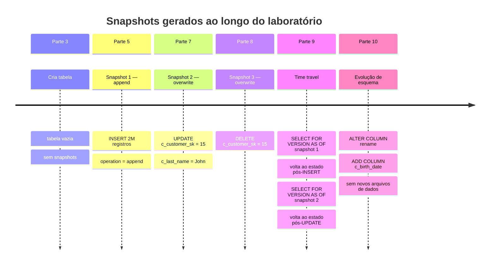
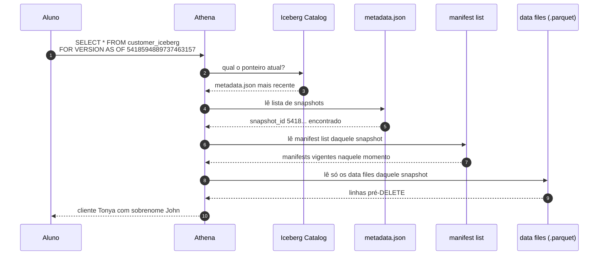

# 02.1 - Funcionalidades básicas com Apache Iceberg no Athena

> **Quarta-feira, 9h.**
> Você é engenheira de dados na **Olist Lakehouse**, uma plataforma de e-commerce brasileira que migrou recentemente do data warehouse tradicional para um data lake no S3. **Camila**, a líder de plataforma de dados, te chama:
>
> > *— "A gente tem 2 milhões de registros de clientes no S3 que precisam aceitar **correções pontuais** quando o time de CRM atualiza cadastro. No DW antigo era um simples UPDATE. Aqui no lake, ainda usando Hive table, o time perdeu 3 dias na semana passada reescrevendo a tabela inteira. Vamos resolver isso com Iceberg?"*
>
> Você sabe que Iceberg promete `UPDATE`, `DELETE`, time travel, evolução de esquema — tudo o que o lake tradicional não tem. Mas precisa **ver funcionando** antes de propor migrar todas as tabelas críticas.

Esse laboratório é o que vamos fazer juntos durante a aula: criar uma tabela Iceberg no Athena, carregar dados reais (TPC-DS), e exercitar **na prática** as operações que o lake "puro" não suportava — `INSERT`, `UPDATE`, `DELETE`, time travel por snapshot e por timestamp, evolução de esquema. No final, você terá feito tudo o que Camila precisava ver para tomar a decisão de migrar.

> [!WARNING]
> **Pré-requisitos obrigatórios antes de começar:**
>
> - [ ] Credenciais AWS do Academy atualizadas no Codespaces — ver [Preparando Credenciais](../../00-create-codespaces/Inicio-de-aula.md)
> - [ ] Codespaces da disciplina aberto com terminal funcional
> - [ ] Você consegue acessar o [console do Amazon Athena](https://us-east-1.console.aws.amazon.com/athena/home?region=us-east-1#/landing-page)
>
> **Valide rapidamente:**
>
> ```bash
> aws sts get-caller-identity
> ```
>
> Se retornar o JSON com seu `Account` e `Arn`, você está pronto.

## O que você vai fazer

Tempo estimado: **60–90 min** (execução pura ~10 min de setup + tempo para você ler, copiar comandos no Athena, observar resultados nos prints e entender o que mudou no S3 a cada operação).

Observe que o Amazon Athena fornece suporte integrado para o Apache Iceberg, permitindo ler e gravar em tabelas Iceberg sem adicionar dependências ou configurações extras. Isso é válido para tabelas na [especificação Iceberg v2](https://iceberg.apache.org/spec/#version-2-row-level-deletes).

## Principais pontos de aprendizagem

- criar tabelas Iceberg
- inserir dados em uma tabela Iceberg
- atualizar um único registro
- excluir registros de uma tabela Iceberg
- consultar snapshots e histórico
- evoluir o esquema da tabela

## O que você terá ao final

Ao final deste laboratório, você terá criado uma tabela Iceberg no Athena, carregado dados nela, executado operações de `INSERT`, `UPDATE`, `DELETE`, `FOR VERSION AS OF`, `FOR TIMESTAMP AS OF` e mudanças de esquema. **Camila vai querer ver os 3 momentos do histórico (insert, update, delete) consultáveis via time travel** — esse é o entregável simbólico do lab.

> [!TIP]
> Sempre que encontrar um bloco com o título **💡 Clique para entender**, abra esse trecho. Ele traz explicação detalhada do comando, contexto prático da aula e links oficiais para aprofundamento.

## Mapa do lab

| Parte | O que você faz | Passos | Tempo |
|-------|----------------|--------|-------|
| [Parte 1](#parte-1---pré-requisitos-e-criação-do-ambiente) | Pré-requisitos e criação do ambiente | [1](#passo-1) · [2](#passo-2) | ~5 min |
| [Parte 2](#parte-2---configurando-o-athena) | Configurando o Athena | [3](#passo-3) · [4](#passo-4) · [5](#passo-5) · [6](#passo-6) · [7](#passo-7) | ~5 min |
| [Parte 3](#parte-3---criando-a-base-iceberg) | Criando a base Iceberg | [8](#passo-8) · [9](#passo-9) · [10](#passo-10) · [11](#passo-11) | ~5 min |
| [Parte 4](#parte-4---entendendo-a-estrutura-da-tabela-iceberg) | Entendendo a estrutura da tabela Iceberg | [12](#passo-12) · [13](#passo-13) · [14](#passo-14) | ~10 min |
| [Parte 5](#parte-5---inserindo-dados) | Inserindo dados | [15](#passo-15) · [16](#passo-16) · [17](#passo-17) | ~5 min |
| [Parte 6](#parte-6---explorando-dados-e-metadados-no-s3) | Explorando dados e metadados no S3 | [18](#passo-18) · [19](#passo-19) · [20](#passo-20) · [21](#passo-21) · [22](#passo-22) | ~10 min |
| [Parte 7](#parte-7---atualizando-registros) | Atualizando registros | [23](#passo-23) · [24](#passo-24) · [25](#passo-25) · [26](#passo-26) | ~5 min |
| [Parte 8](#parte-8---excluindo-registros) | Excluindo registros | [27](#passo-27) · [28](#passo-28) | ~5 min |
| [Parte 9](#parte-9---time-travel) | Time travel (snapshot e timestamp) | [29](#passo-29) · [30](#passo-30) · [31](#passo-31) | ~10 min |
| [Parte 10](#parte-10---evolução-do-esquema) | Evolução do esquema | [32](#passo-32) · [33](#passo-33) · [34](#passo-34) · [35](#passo-35) · [36](#passo-36) · [37](#passo-37) · [38](#passo-38) | ~10 min |

> [!TIP]
> Se travou em algum passo, você pode pular direto: clique no número do passo na coluna **Passos** acima.

## Linha do tempo da tabela `customer_iceberg`

A tabela vai mudar de estado várias vezes ao longo do lab. Cada operação confirmada gera um **novo snapshot**, e nenhum snapshot anterior é apagado — é isso que viabiliza o time travel no fim. Este é o destino que vamos construir:



> [!NOTE]
> Em formatos abertos como Iceberg, **alterar a tabela ≠ apagar o passado**. Cada `INSERT`, `UPDATE`, `DELETE` cria uma nova versão consultável. Esse é o ponto que diferencia uma tabela Iceberg de um simples conjunto de arquivos Parquet.

---

## Parte 1 - Pré-requisitos e criação do ambiente

### Resultado esperado desta parte

Ao final desta etapa, o ambiente base do Athena estará pronto para o laboratório.

---

<a id="passo-1"></a>

1. No Codespaces da disciplina, abra um terminal integrado.


<a id="passo-2"></a>

2. No terminal, execute o script abaixo para preparar automaticamente o ambiente do laboratório no Athena, baixando os dados TPC-DS, enviando-os ao S3 e criando as tabelas necessárias:

```bash
cd /workspaces/FIAP-Data-Warehouse-Lakehouse-e-Data-Mesh && bash setup_athena_tpcds.sh
```

<details>
<summary><b>💡 Clique para entender: preparo automático do ambiente</b></summary>
<blockquote>

Esse comando executa um script shell que funciona como um orquestrador do laboratório. A ideia é eliminar tarefas repetitivas de preparação para que a aula fique concentrada no comportamento do Apache Iceberg dentro do Athena.

Em um cenário como este, o script normalmente encadeia etapas como:

- preparar variáveis de ambiente e caminhos de trabalho
- disponibilizar os dados TPC-DS usados nos exemplos
- copiar ou organizar esses dados no Amazon S3
- criar o contexto inicial necessário no Athena
- deixar tabelas de apoio, como `tpcds.prepared_customer`, prontas para consulta

Em outras palavras, ele transforma um processo operacional com vários passos em uma única execução controlada.

### Por que isso é importante nesta aula

Se você tivesse que fazer tudo manualmente, gastaria tempo com download, upload, organização de pastas, criação de estruturas e validações que não são o objetivo principal do exercício. Aqui, o foco é entender recursos de tabela aberta, snapshots, alterações transacionais e consumo analítico.

### Como validar que o script cumpriu o papel dele

Depois da execução, os sinais mais comuns de sucesso são:

- o Athena passa a ter acesso ao ambiente que será usado no laboratório
- as tabelas do conjunto TPC-DS preparado ficam disponíveis
- consultas como seleção, inserção e criação de tabelas Iceberg conseguem avançar sem erro de base inexistente

### Padrão de uso desse tipo de automação

Esse é um padrão muito comum em ambientes de engenharia de dados:

1. preparar a infraestrutura mínima
2. carregar ou registrar dados-base
3. executar a camada analítica em cima desse ambiente já organizado

Ou seja, o script não é o objetivo final da prática. Ele é a fundação que permite exercitar o que realmente importa na aula.

Documentação oficial:
- [Usando Apache Iceberg com o Athena](https://docs.aws.amazon.com/athena/latest/ug/querying-iceberg.html)
- [Criação de tabelas no Athena](https://docs.aws.amazon.com/athena/latest/ug/create-table.html)
- [TPC-DS como benchmark analítico](https://www.tpc.org/tpcds/)

</blockquote>
</details>


> [!IMPORTANT]
> Só siga para a próxima parte depois que esse script terminar com sucesso.

---

## Parte 2 - Configurando o Athena

### Resultado esperado desta parte

Ao final desta etapa, o editor de consultas do Athena estará configurado para salvar resultados no bucket correto.

---

<a id="passo-3"></a>

3. Acesse o [console do Amazon Athena](https://us-east-1.console.aws.amazon.com/athena/home?region=us-east-1#/landing-page).

<a id="passo-4"></a>

4. Selecione **Consulte seus dados no console do Athena** e depois **Iniciar editor de consultas**.


---

<a id="passo-5"></a>

5. Quando estiver dentro do Athena, clique em **Editar configurações** e depois em **Gerenciar**.


---

<a id="passo-6"></a>

6. Clique em `Browse S3`, selecione o bucket que inicia com `otfs-aula`, escolha a pasta `athena_res/` e depois clique em `Choose` e `Salvar`.


---

<a id="passo-7"></a>

7. Volte para a tela do **Editor**.


### Checkpoint

Se você chegou até aqui, então:

- o Athena está acessível
- o editor de consultas está aberto
- o local de saída das consultas foi configurado

---

## Parte 3 - Criando a base Iceberg

### Resultado esperado desta parte

Ao final desta etapa, o banco `athena_iceberg_db` e a tabela `customer_iceberg` estarão criados.

---

<a id="passo-8"></a>

8. Crie o banco de dados:

```sql
create database athena_iceberg_db;
```


---

<a id="passo-9"></a>

9. Crie a tabela Iceberg abaixo. Antes de executar, substitua `<your-account-id>` pelo ID da sua conta atual.


```sql
CREATE TABLE athena_iceberg_db.customer_iceberg (
    c_customer_sk INT COMMENT 'unique id',
    c_customer_id STRING,
    c_first_name STRING,
    c_last_name STRING,
    c_email_address STRING)
LOCATION 's3://otfs-aula-<your-account-id>/datasets/athena_iceberg/customer_iceberg'
TBLPROPERTIES (
  'table_type'='iceberg',
  'format'='PARQUET',
  'write_compression'='zstd'
);
```


<details>
<summary><b>💡 Clique para entender: criação da tabela Iceberg</b></summary>
<blockquote>

Esse é um dos comandos centrais do laboratório, porque ele define tanto a estrutura lógica da tabela quanto o comportamento transacional esperado no data lake.

### Anatomia do comando

A instrução pode ser lida em blocos:

- definição do nome completo da tabela: `athena_iceberg_db.customer_iceberg`
- definição das colunas e tipos de dados
- indicação do caminho físico no S3 com `LOCATION`
- ativação do formato aberto com `TBLPROPERTIES`

### O papel de cada parte

- `LOCATION` aponta para o local onde os arquivos de dados e metadados do Iceberg serão mantidos
- `'table_type'='iceberg'` habilita os recursos de snapshot, evolução de esquema e operações de linha
- `'format'='PARQUET'` escolhe um formato colunar muito eficiente para leitura analítica
- `'write_compression'='zstd'` ajuda a reduzir tamanho de armazenamento e volume lido nas consultas

### O que muda em relação a uma tabela externa tradicional

Em uma tabela simples sobre arquivos no S3, você normalmente pensa apenas em leitura de arquivos. No Iceberg, você passa a ter também:

- controle de versões da tabela
- histórico de mudanças
- suporte a `UPDATE`, `DELETE` e `MERGE`
- evolução de esquema com muito menos impacto operacional

### Padrão mental para interpretar esse comando

Sempre que estiver criando uma tabela Iceberg no Athena, pense em três camadas:

1. esquema lógico que o usuário consulta
2. dados físicos armazenados no S3
3. metadados que conectam uma versão da tabela aos arquivos corretos

É essa camada de metadados que torna possível o time travel e a consistência transacional.

Documentação oficial:
- [Criando tabelas Iceberg no Athena](https://docs.aws.amazon.com/athena/latest/ug/querying-iceberg-creating-tables.html)
- [Especificação oficial do Apache Iceberg](https://iceberg.apache.org/spec/)
- [Visão geral do Apache Iceberg](https://iceberg.apache.org/docs/latest/)

</blockquote>
</details>

---

<a id="passo-10"></a>

10. Valide se a tabela foi criada:

```sql
SHOW TABLES IN athena_iceberg_db;
```


---

<a id="passo-11"></a>

11. Consulte o esquema da tabela:

```sql
DESCRIBE customer_iceberg;
```


### O que validar aqui

- o banco `athena_iceberg_db` existe
- a tabela `customer_iceberg` existe
- a tabela ainda está vazia

---

## Parte 4 - Entendendo a estrutura da tabela Iceberg

A estrutura subjacente do Iceberg é organizada em metadados, snapshots, manifestos e arquivos de dados.


Em alto nível:

- cada operação confirmada gera um novo snapshot
- cada alteração relevante gera um novo arquivo de metadados
- a tabela aponta sempre para o metadado mais recente
- os manifestos apontam para os arquivos de dados

As tabelas Athena Iceberg expõem metadados de tabela, como `files`, `manifests`, `history` e `snapshots`.

---

<a id="passo-12"></a>

12. Consulte os arquivos da tabela. Como a tabela ainda não tem dados, o retorno deverá estar vazio.

```sql
SELECT * FROM "athena_iceberg_db"."customer_iceberg$files"
```


---

<a id="passo-13"></a>

13. Consulte os manifestos da tabela:

```sql
SELECT * FROM "athena_iceberg_db"."customer_iceberg$manifests"
```

---

<a id="passo-14"></a>

14. Consulte os snapshots da tabela:

```sql
SELECT * FROM "athena_iceberg_db"."customer_iceberg$snapshots"
```

<details>
<summary><b>💡 Clique para entender: tabelas de metadados do Iceberg</b></summary>
<blockquote>

Essas consultas são extremamente valiosas porque mostram o que está por trás da tabela sem exigir inspeção manual dos arquivos no S3.

### O que cada sufixo revela

- `$files`: lista os arquivos de dados efetivamente considerados pela versão atual da tabela
- `$manifests`: mostra os manifestos que agrupam metadados sobre conjuntos de arquivos
- `$snapshots`: apresenta cada versão materializada da tabela ao longo do tempo
- `$history`: mostra em que momento cada snapshot passou a ser o estado corrente

### Por que isso importa em uma open table format

Em um lakehouse moderno, a tabela não é apenas uma pasta com arquivos. Ela é um conjunto coordenado de dados + metadados + histórico. Quando você consulta essas tabelas auxiliares, está enxergando exatamente esse mecanismo de coordenação.

### Exemplos de uso prático

Esses metadados são úteis para:

- validar se uma carga gerou novos arquivos
- identificar se um `UPDATE` ou `DELETE` criou um novo snapshot
- investigar o histórico de mudanças de uma tabela
- descobrir o `snapshot_id` que será usado em time travel

### Padrão de leitura dos resultados

Se a tabela ainda estiver vazia, é esperado ver pouco ou nenhum retorno. Depois de um `INSERT`, você tende a ver:

- arquivos Parquet em `$files`
- referências Avro em `$manifests`
- um novo registro em `$snapshots`
- a linha correspondente aparecendo em `$history`

Essa é uma das formas mais didáticas de entender que o Iceberg controla estado por versão, e não apenas por presença física de arquivos.

Documentação oficial:
- [Consultar tabelas Iceberg no Athena](https://docs.aws.amazon.com/athena/latest/ug/querying-iceberg-table-data.html)
- [Inspeção de metadados no Apache Iceberg](https://iceberg.apache.org/docs/latest/spark-queries/#inspecting-tables)

</blockquote>
</details>

> [!NOTE]
> Neste momento, essas consultas não devem retornar dados relevantes, porque a tabela ainda está vazia.

---

## Parte 5 - Inserindo dados

### Resultado esperado desta parte

Ao final desta etapa, a tabela `customer_iceberg` terá dados carregados a partir de `tpcds.prepared_customer`.

---

<a id="passo-15"></a>

15. Insira os registros na tabela:

```sql
INSERT INTO athena_iceberg_db.customer_iceberg
SELECT * FROM tpcds.prepared_customer
```

A execução deve terminar com a mensagem **Consulta bem-sucedida**.

<details>
<summary><b>💡 Clique para entender: carregamento com INSERT INTO ... SELECT</b></summary>
<blockquote>

Esse padrão de comando é um dos mais importantes em pipelines analíticos. Ele lê dados de uma origem já preparada e os grava em uma tabela de destino mantendo o formato e as propriedades do Iceberg.

### O que está acontecendo aqui

- a origem é `tpcds.prepared_customer`
- o destino é `athena_iceberg_db.customer_iceberg`
- cada linha selecionada é convertida em arquivos de dados controlados pelo Iceberg
- ao final, um novo snapshot é criado para representar o novo estado da tabela

### Por que esse padrão é tão usado

`INSERT INTO ... SELECT` é a base de muitos processos de:

- ingestão batch
- transformação de dados entre camadas
- preenchimento inicial de tabelas analíticas
- migração de dados para formatos de tabela abertos

### O que observar depois da execução

Após rodar o comando, vale conferir:

- se a contagem da tabela bate com o volume esperado
- se o caminho no S3 passou a ter arquivos em `data` e `metadata`
- se surgiu um novo snapshot nas tabelas de metadados

Documentação oficial:
- [INSERT INTO no Athena](https://docs.aws.amazon.com/athena/latest/ug/insert-into.html)
- [Usando tabelas Iceberg no Athena](https://docs.aws.amazon.com/athena/latest/ug/querying-iceberg.html)

</blockquote>
</details>

---

<a id="passo-16"></a>

16. Consulte os primeiros registros:

```sql
select * from athena_iceberg_db.customer_iceberg limit 10;
```


---

<a id="passo-17"></a>

17. Conte o total de registros:

```sql
select count(*) from athena_iceberg_db.customer_iceberg;
```

O resultado esperado é **2.000.000** registros.

### Checkpoint

Se você chegou até aqui, então:

- a tabela foi carregada com sucesso
- já existem arquivos de dados e metadados associados a ela

---

## Parte 6 - Explorando dados e metadados no S3

<a id="passo-18"></a>

18. No local da tabela no [Amazon S3](https://us-east-1.console.aws.amazon.com/s3/home?region=us-east-1), abra:

`s3://otfs-aula-<your-account-id>/datasets/athena_iceberg/customer_iceberg/`

Você deverá ver duas pastas:

- `data`
- `metadata`

A pasta `data` contém os dados em Parquet, e a pasta `metadata` contém os arquivos de metadados.

Tipos de arquivo esperados em `metadata`:

- arquivos `.metadata.json`
- listas de manifesto `*-m*.avro`
- manifestos `snap-*.avro`

Pasta de metadados:


Pasta de dados:


---

<a id="passo-19"></a>

19. Liste os arquivos da tabela:

```sql
SELECT * FROM "athena_iceberg_db"."customer_iceberg$files"
```

---

<a id="passo-20"></a>

20. Liste os manifestos:

```sql
SELECT * FROM "athena_iceberg_db"."customer_iceberg$manifests"
```

---

<a id="passo-21"></a>

21. Consulte o histórico:

```sql
SELECT * FROM "athena_iceberg_db"."customer_iceberg$history"
```

---

<a id="passo-22"></a>

22. Consulte os snapshots:

```sql
SELECT * FROM "athena_iceberg_db"."customer_iceberg$snapshots"
```

### O que observar

- em `files`, caminhos de arquivos `.parquet`
- em `manifests`, caminhos de arquivos `.avro`
- em `history` e `snapshots`, valores como `snapshot_id`, `parent_id` e `manifest_list`

---

## Parte 7 - Atualizando registros

### Resultado esperado desta parte

Ao final desta etapa, o registro do cliente com `c_customer_sk = 15` terá sido corrigido.

---

<a id="passo-23"></a>

23. Consulte o registro do cliente:

```sql
select * from athena_iceberg_db.customer_iceberg
WHERE c_customer_sk = 15
```

Observe que `c_last_name` e `c_email_address` estão `null`.

---

<a id="passo-24"></a>

24. Atualize o registro:

```sql
UPDATE athena_iceberg_db.customer_iceberg
SET c_last_name = 'John', c_email_address = 'johnTonya@abx.com'
WHERE c_customer_sk = 15
```

A consulta deve terminar com **Consulta bem-sucedida**.

<details>
<summary><b>💡 Clique para entender: UPDATE em tabela Iceberg</b></summary>
<blockquote>

Esse comando faz uma correção pontual de dado, algo muito comum em cenários reais de lakehouse quando há enriquecimento, ajuste cadastral ou retificação operacional.

### Estrutura lógica do comando

- `UPDATE ... SET ...` define quais colunas serão alteradas
- `WHERE c_customer_sk = 15` restringe a mudança a um único registro

Sem esse filtro, o impacto seria muito maior. Em ambiente analítico, esse cuidado é fundamental.

### O que o Iceberg faz internamente

O comportamento relevante aqui não é só o SQL em si, mas a forma como o Iceberg registra a alteração. Em vez de depender de uma reescrita completa da tabela, ele controla a modificação pela camada de metadados e pelos arquivos relacionados ao snapshot novo.

Isso traz benefícios como:

- consistência transacional
- rastreabilidade da mudança
- possibilidade de consultar o estado anterior por time travel
- menor impacto operacional comparado a abordagens mais rígidas

### Padrões de uso

Esse tipo de atualização costuma ser usado para:

- corrigir atributos nulos ou incorretos
- preencher dados de cadastro depois de uma etapa de enriquecimento
- aplicar ajustes vindos de sistemas operacionais

### Boa prática

Sempre valide o registro antes e depois do `UPDATE`, exatamente como o laboratório propõe. Esse padrão reduz risco de alteração indevida e ajuda a ensinar comportamento transacional de tabela aberta.

Documentação oficial:
- [UPDATE em tabelas Iceberg no Athena](https://docs.aws.amazon.com/athena/latest/ug/querying-iceberg-update.html)
- [Boas práticas de escrita com Apache Iceberg na AWS](https://docs.aws.amazon.com/prescriptive-guidance/latest/apache-iceberg-on-aws/best-practices-write.html)

</blockquote>
</details>

---

<a id="passo-25"></a>

25. Valide a alteração:

```sql
select * from athena_iceberg_db.customer_iceberg
WHERE c_customer_sk = 15
```

Agora o sobrenome e o e-mail devem aparecer preenchidos.

### Observação técnica

Athena usa [merge-on-read](https://docs.aws.amazon.com/pt_br/prescriptive-guidance/latest/apache-iceberg-on-aws/best-practices-write.html) para operações `UPDATE`.

Na prática, isso significa que:

- ele grava arquivos de exclusão por posição
- grava também as linhas atualizadas
- evita reescrever arquivos inteiros desnecessariamente

---

<a id="passo-26"></a>

26. Verifique o impacto da operação na camada de dados:

```sql
SELECT * FROM "athena_iceberg_db"."customer_iceberg$files"
```


> [!TIP]
> Você pode identificar novos arquivos observando o `LastModified` no S3.

---

## Parte 8 - Excluindo registros

### Resultado esperado desta parte

Ao final desta etapa, o registro do cliente com `c_customer_sk = 15` terá sido removido da visualização atual da tabela.

---

<a id="passo-27"></a>

27. Exclua o registro:

```sql
delete from athena_iceberg_db.customer_iceberg
WHERE c_customer_sk = 15
```

A consulta deve terminar com **Consulta bem-sucedida**.

---

<a id="passo-28"></a>

28. Valide a remoção:

```sql
SELECT * FROM athena_iceberg_db.customer_iceberg WHERE c_customer_sk = 15
```

O resultado esperado é **Nenhum resultado**.

### Observação técnica

Athena também usa `merge-on-read` para `DELETE`, criando arquivos de exclusão baseados em posição em vez de reescrever todos os arquivos de dados.

<details>
<summary><b>💡 Clique para entender: DELETE em tabela Iceberg</b></summary>
<blockquote>

O `DELETE` remove o registro da visão atual da tabela, mas o aprendizado mais importante aqui é entender que, no Iceberg, exclusão não significa simplesmente apagar um arquivo inteiro do S3.

### O que esse comando representa

Você está dizendo ao mecanismo de tabela que determinado registro não deve mais aparecer no estado corrente. A tabela então gera um novo snapshot coerente com essa remoção.

### Por que isso é poderoso

Esse comportamento permite:

- exclusões mais seguras em ambiente analítico
- manutenção de histórico para auditoria
- integração com fluxos de correção e conformidade de dados

### Padrão prático

Em projetos reais, `DELETE` costuma aparecer em situações como:

- remoção de registros inválidos
- atendimento a regras de governança
- exclusão de duplicidades
- correções de cargas mal executadas

### Relação com time travel

Mesmo após o `DELETE`, uma versão anterior da tabela ainda pode ser consultada por snapshot ou timestamp. Isso ajuda muito em investigação, rollback lógico e validação de mudanças.

Documentação oficial:
- [DELETE em tabelas Iceberg no Athena](https://docs.aws.amazon.com/athena/latest/ug/querying-iceberg-delete.html)
- [Operações de linha no Apache Iceberg](https://iceberg.apache.org/spec/#row-level-deletes)

</blockquote>
</details>

---

## Parte 9 - Time travel

### Resultado esperado desta parte

Ao final desta etapa, você terá consultado versões anteriores da tabela usando snapshot e timestamp.

### Como o Athena resolve um SELECT com `FOR VERSION AS OF`

Quando você pede um snapshot anterior, o Athena **não** restaura backup nem clona arquivos. Ele apenas navega na cadeia de metadados e lê os arquivos físicos que pertenciam àquela versão:



> [!IMPORTANT]
> O time travel **não** copia dados. O Iceberg só "esquece" os arquivos antigos quando você roda `VACUUM` ou `expire_snapshots` — até lá, todas as versões são consultáveis sem custo extra de armazenamento (os arquivos já existiam).

---

<a id="passo-29"></a>

29. Consulte o histórico da tabela:

```sql
SELECT * FROM "athena_iceberg_db"."customer_iceberg$history"
order by made_current_at;
```


Você deverá ver 3 momentos principais:

- inserção inicial
- atualização
- exclusão

---

<a id="passo-30"></a>

30. Substitua `5418594889737463157` pelo `snapshot_id` da linha correspondente ao segundo snapshot e consulte a tabela naquele ponto do tempo:

```sql
select * from athena_iceberg_db.customer_iceberg
FOR VERSION AS OF  5418594889737463157
WHERE c_customer_sk = 15
```

O resultado deve mostrar o registro do cliente Tonya.

---

<a id="passo-31"></a>

31. Agora faça a mesma ideia usando timestamp. Substitua o timestamp abaixo pelo valor de `made_current_at` da linha correta no histórico:

```sql
select * from athena_iceberg_db.customer_iceberg
FOR TIMESTAMP AS OF TIMESTAMP '2024-04-16 17:21:49.771 UTC'
WHERE c_customer_sk = 15
```

Novamente, o resultado deve mostrar o registro do cliente Tonya.

<details>
<summary><b>💡 Clique para entender: time travel com snapshot e timestamp</b></summary>
<blockquote>

Time travel é um dos recursos mais característicos do Iceberg. Ele permite consultar a tabela como ela estava em um momento anterior, sem restaurar backup e sem alterar o estado atual.

### Duas formas de navegar no passado

- `FOR VERSION AS OF`: usa um identificador exato de snapshot
- `FOR TIMESTAMP AS OF`: usa um ponto no tempo, e o mecanismo resolve qual snapshot estava ativo naquele instante

### Quando usar cada uma

Use `FOR VERSION AS OF` quando você quer precisão máxima, por exemplo em auditoria técnica. Use `FOR TIMESTAMP AS OF` quando a pergunta é temporal, como “como a tabela estava antes da exclusão?”.

### Exemplos de situações reais

Esse recurso é muito útil para:

- investigar quando uma informação mudou
- comparar o antes e o depois de um `UPDATE` ou `DELETE`
- validar resultados de uma carga incremental
- recuperar contexto histórico para auditoria ou debugging

### Padrão mental importante

O Iceberg não precisa clonar a tabela inteira para fazer isso. Ele usa a cadeia de snapshots e metadados para reconstruir a visão correta daquele ponto no tempo.

É exatamente por isso que consultar `history` e `snapshots` antes dessa etapa ajuda tanto na compreensão do laboratório.

Documentação oficial:
- [Time travel em tabelas Iceberg no Athena](https://docs.aws.amazon.com/athena/latest/ug/querying-iceberg-time-travel-and-version-travel-queries.html)
- [Time travel no Apache Iceberg](https://iceberg.apache.org/docs/latest/spark-queries/#time-travel)

</blockquote>
</details>

---

## Parte 10 - Evolução do esquema

### Resultado esperado desta parte

Ao final desta etapa, a tabela terá uma coluna renomeada e uma nova coluna adicionada, sem reescrita dos arquivos de dados.

As mudanças de esquema no Iceberg são alterações de metadados. Em geral, os arquivos de dados não precisam ser recriados.

---

<a id="passo-32"></a>

32. Consulte os arquivos de dados da tabela:

```sql
SELECT * FROM "athena_iceberg_db"."customer_iceberg$files"
```

Anote o caminho e o nome do arquivo.

---

<a id="passo-33"></a>

33. Renomeie a coluna `c_email_address` para `email`:

```sql
ALTER TABLE athena_iceberg_db.customer_iceberg
change column c_email_address email STRING
```

---

<a id="passo-34"></a>

34. Consulte os arquivos novamente:

```sql
SELECT * FROM "athena_iceberg_db"."customer_iceberg$files"
```

Observe que não há novos arquivos de dados criados por causa da mudança de esquema.

---

<a id="passo-35"></a>

35. Valide o novo esquema:

```sql
DESCRIBE customer_iceberg;
```

---

<a id="passo-36"></a>

36. Adicione uma nova coluna chamada `c_birth_date`:

```sql
ALTER TABLE athena_iceberg_db.customer_iceberg ADD COLUMNS (c_birth_date int)
```

---

<a id="passo-37"></a>

37. Valide novamente:

```sql
DESCRIBE customer_iceberg;
```

---

<a id="passo-38"></a>

38. Consulte a tabela com a nova coluna:

```sql
SELECT *
FROM athena_iceberg_db.customer_iceberg
LIMIT 10
```

A nova coluna deverá aparecer com valores `null` para os registros já existentes.

<details>
<summary><b>💡 Clique para entender: evolução de esquema no Iceberg</b></summary>
<blockquote>

Evolução de esquema é a capacidade de adaptar a estrutura da tabela ao longo do tempo sem quebrar todo o pipeline analítico. Em data platforms reais, isso acontece o tempo todo.

### O que este laboratório mostra

Aqui você realiza duas mudanças clássicas:

- renomear uma coluna existente
- adicionar uma nova coluna ao esquema

### Por que isso é relevante

Em modelos tradicionais, mudanças de esquema podem exigir cópia de dados, recriação de tabelas ou ajustes operacionais maiores. No Iceberg, muitas dessas alterações são registradas na camada de metadados, o que reduz custo e complexidade.

### O que esperar depois da alteração

- o novo nome aparece no `DESCRIBE`
- a nova coluna passa a existir na leitura da tabela
- linhas antigas aparecem com `null` na coluna recém-adicionada, porque esses registros foram gravados antes da mudança

### Cenários reais

Esse recurso é valioso quando:

- um sistema de origem passou a fornecer um novo atributo
- um nome de coluna precisa ficar mais claro para consumo analítico
- o modelo precisa evoluir sem interromper consultas existentes

Documentação oficial:
- [Usando Apache Iceberg com o Athena](https://docs.aws.amazon.com/athena/latest/ug/querying-iceberg.html)
- [Evolução de esquema no Apache Iceberg](https://iceberg.apache.org/docs/latest/evolution/#schema-evolution)

</blockquote>
</details>

---

## Conclusão

Se você chegou até aqui, então já executou:

- criação de banco e tabela Iceberg
- inserção de dados (2 milhões de registros TPC-DS)
- leitura de metadados (`$files`, `$manifests`, `$snapshots`, `$history`)
- atualização de registros pontuais (UPDATE com filtro)
- exclusão de registros (DELETE com filtro)
- time travel por snapshot e timestamp
- evolução de esquema (rename de coluna + adição de coluna sem reescrita)

**Mensagem para Camila**: o Iceberg entrega o que prometia. As correções pontuais que antes levavam 3 dias agora são `UPDATE` em segundos, com histórico preservado para auditoria. Está pronto para migrar.

Este laboratório forma a base para os próximos exercícios com funcionalidades mais avançadas do Iceberg.

---

## Próximo passo

Abra o próximo lab: **[Lab 02.2 — Funcionalidades avançadas com Apache Iceberg](../02-Funcionalidades-avancadas/README.md)**.

Lá Camila volta com 3 demandas mais difíceis: **particionamento eficiente** (consultas por ano sem varrer a tabela inteira), **MERGE INTO** (sincronizar atualizações vindas do CRM em batch), e **OPTIMIZE** (manter a tabela rápida ao longo do tempo).

> [!CAUTION]
> **Custo do lab**: o ambiente roda sobre Athena (pay-per-query) + S3 (~$0,02/GB-mês). Sem cluster pago — você não paga nada por deixar a infra parada. Mesmo assim, ao final dos 3 labs do módulo, é boa prática limpar os buckets/databases criados; instruções no Lab 02.3.

---

<details>
<summary><b>💡 Glossário rápido — termos que aparecem neste lab</b></summary>
<blockquote>

| Termo | O que é |
|-------|---------|
| **Open Table Format** | Especificação que adiciona camada de metadados sobre arquivos no data lake (Parquet, ORC) para suportar transações ACID, time travel, evolução de esquema. Iceberg, Delta e Hudi são os 3 principais. |
| **Iceberg v2** | Versão da especificação Iceberg que suporta `row-level deletes` (UPDATE/DELETE em linhas individuais). Athena usa v2 por padrão. |
| **Snapshot** | Versão imutável da tabela em um instante. Cada `INSERT`/`UPDATE`/`DELETE` gera um novo snapshot. Time travel navega entre eles. |
| **Manifest file** | Arquivo Avro que lista um conjunto de arquivos de dados (`.parquet`) pertencentes a um snapshot. |
| **Manifest list** | Arquivo Avro que lista os manifests de um snapshot. É o "índice de índices". |
| **Metadata file** | JSON com o estado da tabela: schema, partition spec, lista de snapshots, ponteiro do snapshot atual. Cada commit gera um novo. |
| **Merge-on-read** | Estratégia onde `UPDATE`/`DELETE` cria arquivos de exclusão por posição em vez de reescrever o arquivo de dados inteiro. Mais barato na escrita, mais caro na leitura. Default do Athena Iceberg. |
| **Copy-on-write** | Estratégia oposta: `UPDATE`/`DELETE` reescreve os arquivos de dados afetados. Mais barato na leitura, mais caro na escrita. |
| **Time travel** | Consultar a tabela como ela estava em um snapshot ou timestamp passado, sem restaurar backup. |
| **Schema evolution** | Capacidade de renomear, adicionar ou remover colunas sem reescrever os arquivos de dados existentes. No Iceberg é mudança de metadado. |
| **TPC-DS** | Benchmark analítico padrão para data warehouse (24 tabelas, schema de varejo). Usado aqui só como dataset realista de 2M clientes. |

</blockquote>
</details>

<details>
<summary><b>💡 Como pedir ajuda se travou</b></summary>
<blockquote>

Antes de abrir issue/perguntar no Slack, colete estas 4 informações — elas reduzem o tempo de resposta em 10×:

1. **Em que passo você está** (ex: "passo 24, rodando o `UPDATE`")
2. **Mensagem de erro literal** (copia-cola completo do painel de query do Athena, não screenshot — texto é pesquisável)
3. **Saída de** `SHOW TABLES IN athena_iceberg_db;` no Athena (mostra o que foi criado de fato)
4. **O que você já tentou**

Canais (em ordem de prioridade):

- **Issues do repositório**: [github.com/vamperst/FIAP-Data-Warehouse-Lakehouse-e-Data-Mesh/issues](https://github.com/vamperst/FIAP-Data-Warehouse-Lakehouse-e-Data-Mesh/issues)
- **E-mail do professor**: `rafael.barbosa@fiap.com.br`
- **Antes de tudo**: confira se o banco selecionado no painel esquerdo do Athena é `athena_iceberg_db` (~80% dos "tabela não existe" são por banco errado selecionado).

</blockquote>
</details>
