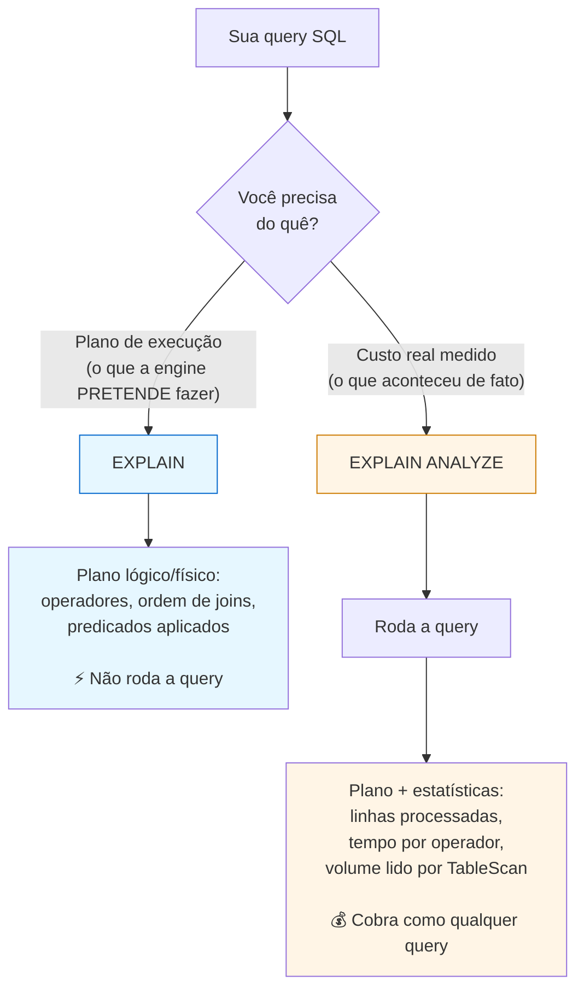

# 02.3 - Consumindo tabelas Iceberg no Athena

> **Segunda-feira da terceira semana.**
> O time analítico da **Olist Lakehouse** começou a usar as tabelas Iceberg em produção. **Pedro**, analista de BI sênior que vai construir o dashboard executivo de pedidos, te chama:
>
> > *— "Camila me passou o acesso. Eu tenho duas perguntas antes de começar a montar o dashboard: **(a)** quando eu rodar `SELECT` numa tabela com 60 milhões de linhas, como sei se o Athena está aproveitando o particionamento ou está varrendo tudo? **(b)** os usuários do dashboard não precisam ver as 17 colunas da `web_sales_iceberg`, só `warehouse_sk` e `num_orders` agrupado. Tem um jeito de eu publicar uma versão simplificada da tabela?"*
>
> Duas perguntas clássicas de consumo analítico — e o Iceberg + Athena tem resposta direta para ambas: **`EXPLAIN`/`EXPLAIN ANALYZE`** e **`CREATE VIEW`**. Vamos exercitar as duas neste lab final do módulo.

Neste laboratório, você explorará como usar o Amazon Athena para consultar tabelas Iceberg do ponto de vista do **consumidor** — analista, dashboard, time de BI.

Observe que o Amazon Athena fornece suporte integrado para o Apache Iceberg, permitindo ler e gravar em tabelas Iceberg sem configurações adicionais. Isso é válido para tabelas na [especificação Iceberg v2](https://iceberg.apache.org/spec/#version-2-row-level-deletes).

> [!WARNING]
> **Pré-requisitos obrigatórios antes de começar:**
>
> - [ ] Labs [02.1](../01-Funcionalidades-Basicas/README.md) e [02.2](../02-Funcionalidades-avancadas/README.md) concluídos com sucesso
> - [ ] Banco com tabelas Iceberg disponível: `athena_iceberg_db`, `glue_iceberg_db` ou `emr_iceberg_db` (depende de qual lab você fez)
> - [ ] Tabelas `customer_iceberg` e `web_sales_iceberg` populadas
> - [ ] Local de saída das consultas configurado no Athena
>
> **Valide rapidamente** rodando esta query no Athena:
>
> ```sql
> SHOW TABLES IN athena_iceberg_db;
> ```
>
> Você deverá ver pelo menos `customer_iceberg` e `web_sales_iceberg`. Se vier vazio, volte aos labs anteriores.

## O que você vai fazer

Tempo estimado: **20–35 min** (execução pura ~2 min de queries + tempo para você ler os planos do `EXPLAIN ANALYZE` e entender o que cada operador faz).

## Principais pontos de aprendizagem

- consultar tabelas Iceberg no Athena
- usar `EXPLAIN` e `EXPLAIN ANALYZE`
- criar e consultar views sobre tabelas Iceberg

## O que você terá ao final

Ao final deste laboratório, você terá uma `VIEW` chamada `total_orders_by_warehouse` publicada e funcional, plus a habilidade de inspecionar planos de execução para entender comportamento de performance — exatamente o que **Pedro** precisava para começar o dashboard executivo.

> [!TIP]
> Sempre que encontrar um bloco com o título **💡 Clique para entender**, abra esse trecho. Ele foi pensado para ajudar o aluno a interpretar o comando e conectar a prática ao conceito.

## Mapa do lab

| Parte | O que você faz | Passos | Tempo |
|-------|----------------|--------|-------|
| [Parte 1](#parte-1---escolhendo-o-banco-correto) | Escolhendo o banco correto | (sem passos numerados — só seleção visual) | ~2 min |
| [Parte 2](#parte-2---consultando-tabelas-iceberg) | Consultando tabelas Iceberg | [1](#passo-1) · [2](#passo-2) | ~5 min |
| [Parte 3](#parte-3---usando-explain-e-explain-analyze) | Usando `EXPLAIN` e `EXPLAIN ANALYZE` | [3](#passo-3) · [4](#passo-4) | ~10 min |
| [Parte 4](#parte-4---criando-e-consultando-visualizações) | Criando e consultando views | [5](#passo-5) · [6](#passo-6) | ~5 min |

> [!TIP]
> Se travou em algum passo, você pode pular direto: clique no número do passo na coluna **Passos** acima.

> [!NOTE]
> Se aparecer erro de tabela inexistente, valide primeiro se o banco selecionado no painel esquerdo do Athena corresponde ao laboratório em que você criou as tabelas.

---

## Parte 1 - Escolhendo o banco correto

### Resultado esperado desta parte

Ao final desta etapa, você terá selecionado o banco correspondente ao laboratório anterior que usou para criar as tabelas.

Esta seção pode ser usada para consultar qualquer uma das tabelas criadas anteriormente.

Selecione no painel esquerdo do Athena o banco correspondente ao ambiente em que você criou as tabelas:

- `glue_iceberg_db`, se criou as tabelas no laboratório de Glue
- `emr_iceberg_db`, se criou as tabelas no laboratório de EMR
- `athena_iceberg_db`, se criou as tabelas no laboratório de Athena


> [!TIP]
> Esse é o ponto de erro mais comum deste laboratório. Se a consulta disser que a tabela não existe, a primeira validação é conferir se o banco selecionado está correto.

---

## Parte 2 - Consultando tabelas Iceberg

### Resultado esperado desta parte

Ao final desta etapa, você terá executado consultas básicas sobre as tabelas Iceberg.

---

<a id="passo-1"></a>

1. Execute a consulta abaixo para consultar um conjunto de dados Iceberg:

```sql
SELECT ws_warehouse_sk, count(distinct(ws_order_number)) as num_orders
FROM web_sales_iceberg
WHERE ws_warehouse_sk in (5,6,10,11)
GROUP BY ws_warehouse_sk
```

---

<a id="passo-2"></a>

2. Verifique a quantidade de registros presentes na tabela de clientes:

```sql
SELECT count(*)
FROM customer_iceberg
```

### Observação importante

As consultas seguem a [especificação de formato Iceberg v2](https://iceberg.apache.org/spec/#format-versioning). Caso a consulta seja executada sobre uma tabela que tenha usado `merge-on-read` — por exemplo, tabelas em `athena_iceberg_db` — os arquivos de exclusão por posição serão mesclados com os arquivos de dados no momento da leitura.

<details>
<summary><b>💡 Clique para entender: consumo de tabelas Iceberg no Athena</b></summary>
<blockquote>

O grande valor aqui é perceber que consumir uma tabela Iceberg é muito mais do que ler um conjunto de arquivos Parquet soltos no S3.

### O que acontece quando você faz um SELECT

Do ponto de vista do aluno, a consulta é apenas SQL. Mas internamente o Athena precisa:

- localizar o snapshot atual da tabela
- identificar os manifestos relevantes
- descobrir quais arquivos de dados pertencem àquela versão
- considerar arquivos de deleção quando existirem operações de linha
- montar a visão consistente que será entregue como resultado

### O que isso muda na prática

Esse mecanismo permite que você tenha em um data lake capacidades típicas de banco analítico moderno, como:

- leitura consistente mesmo após `UPDATE` e `DELETE`
- histórico de versões
- evolução de esquema
- maior governança sobre a tabela

### Padrão mental importante

Em uma open table format, a tabela deixa de ser apenas armazenamento e passa a ser uma estrutura governada por metadados. É isso que viabiliza o conceito de lakehouse.

Documentação oficial:
- [Consultar Apache Iceberg no Athena](https://docs.aws.amazon.com/athena/latest/ug/querying-iceberg.html)
- [Especificação oficial do Apache Iceberg](https://iceberg.apache.org/spec/)

</blockquote>
</details>

### Checkpoint

Se você chegou até aqui, então:

- o banco correto foi selecionado
- as tabelas estão acessíveis
- as consultas básicas estão funcionando

---

## Parte 3 - Usando EXPLAIN e EXPLAIN ANALYZE

### Resultado esperado desta parte

Ao final desta etapa, você terá inspecionado o plano de execução e o custo computacional de consultas no Athena.

### Diferença prática: `EXPLAIN` vs `EXPLAIN ANALYZE`



> [!TIP]
> **Quando usar cada um**: `EXPLAIN` quando você quer **planejar antes** (a query ainda nem foi escrita ou você está iterando no design). `EXPLAIN ANALYZE` quando a query já existe e está lenta — você precisa do dado real do operador que está consumindo recurso para decidir onde otimizar.

---

<a id="passo-3"></a>

3. Use `EXPLAIN` para visualizar o plano lógico ou distribuído da consulta:

```sql
EXPLAIN SELECT count(*) FROM customer_iceberg LIMIT 10;
```

---

<a id="passo-4"></a>

4. Use `EXPLAIN ANALYZE` para visualizar o plano de execução distribuído com custo computacional:

```sql
EXPLAIN ANALYZE
SELECT ws_warehouse_sk, count(distinct(ws_order_number)) as num_orders
FROM web_sales_iceberg
WHERE ws_warehouse_sk in (5,6,10,11)
GROUP BY ws_warehouse_sk
```

<details>
<summary><b>💡 Clique para entender: EXPLAIN e EXPLAIN ANALYZE</b></summary>
<blockquote>

Esses comandos são fundamentais para sair do nível “a consulta funciona” e chegar ao nível “eu entendo como a engine está trabalhando”.

### O que é o EXPLAIN

`EXPLAIN` pede ao Athena o plano de execução da consulta. Em vez de retornar o dado de negócio, ele devolve a estratégia planejada pela engine para ler, filtrar, agregar e distribuir o processamento.

Isso ajuda a responder perguntas como:

- a consulta vai varrer a tabela inteira ou só parte dela?
- há filtros sendo aplicados cedo no plano?
- a agregação está acontecendo de forma esperada?

### O que é o EXPLAIN ANALYZE

`EXPLAIN ANALYZE` vai além: ele executa a consulta e mostra estatísticas reais do que aconteceu. É por isso que ele é tão útil para análise de performance.

### Padrões de uso muito comuns

Você pode usar esses comandos para comparar:

- uma consulta com filtro versus sem filtro
- uma versão antes e depois de particionamento
- uma leitura direta da tabela versus uma view analítica

### Exemplo mental para interpretar

Se você filtra por um subconjunto pequeno de dados e o plano ainda mostra leitura muito ampla, isso é um sinal de que o desenho da tabela ou da consulta pode ser melhorado.

Por outro lado, quando o volume lido cai bastante após um filtro seletivo, isso indica que o mecanismo está aproveitando bem a estrutura do Iceberg.

### O que observar nos resultados

Em geral, vale prestar atenção em:

- operadores de leitura, filtro e agregação
- linhas de entrada e saída
- volume processado
- custo total percebido na execução

Documentação oficial:
- [EXPLAIN e EXPLAIN ANALYZE no Athena](https://docs.aws.amazon.com/athena/latest/ug/athena-explain-statement.html)
- [Como entender os resultados do EXPLAIN](https://docs.aws.amazon.com/athena/latest/ug/athena-explain-statement-understanding.html)

</blockquote>
</details>

> [!TIP]
> Use `EXPLAIN` quando quiser validar ou entender a estratégia de execução. Use `EXPLAIN ANALYZE` quando quiser inspecionar custo real de processamento.

---

## Parte 4 - Criando e consultando visualizações

### Resultado esperado desta parte

Ao final desta etapa, você terá criado uma view sobre a tabela Iceberg e consultado seu resultado.

---

<a id="passo-5"></a>

5. Crie a view abaixo:

```sql
CREATE VIEW total_orders_by_warehouse
AS
SELECT ws_warehouse_sk, count(distinct(ws_order_number)) as num_orders
FROM web_sales_iceberg
WHERE ws_warehouse_sk in (5,6,10,11)
GROUP BY ws_warehouse_sk
```

A execução deve terminar com **Consulta bem-sucedida**.

<details>
<summary><b>💡 Clique para entender: comando CREATE VIEW</b></summary>
<blockquote>

Uma view cria uma camada lógica de consumo sobre a tabela original. Ela não copia os dados nem cria um novo conjunto físico de arquivos no S3.

### O que isso resolve

Em vez de cada pessoa escrever sempre a mesma consulta com filtros e agregações, a view encapsula essa lógica em um objeto reutilizável.

### Vantagens práticas

Ela é útil para:

- simplificar análises repetitivas
- esconder complexidade de consultas maiores
- padronizar indicadores para times diferentes
- criar uma camada mais próxima da linguagem de negócio

### Padrão comum em analytics

É muito comum deixar a tabela Iceberg como camada base e construir views por cima para expor métricas, recortes e regras de leitura mais amigáveis.

### O que aprender com este exemplo

Neste caso, a view resume pedidos por depósito. Isso mostra como transformar uma tabela transacionalmente robusta em um artefato mais fácil de consumir no dia a dia analítico.

Documentação oficial:
- [CREATE VIEW no Athena](https://docs.aws.amazon.com/athena/latest/ug/views-console.html)
- [Consultar Apache Iceberg no Athena](https://docs.aws.amazon.com/athena/latest/ug/querying-iceberg.html)

</blockquote>
</details>

---

<a id="passo-6"></a>

6. Consulte a view criada:

```sql
SELECT *
FROM total_orders_by_warehouse
```

### Checkpoint final

Se você chegou até aqui, então:

- conseguiu consultar tabelas Iceberg diretamente
- conseguiu analisar consultas com `EXPLAIN` e `EXPLAIN ANALYZE`
- conseguiu criar uma `VIEW` sobre dados Iceberg no Athena

---

## Conclusão

Este laboratório fecha o ciclo de uso das tabelas Iceberg pelo ponto de vista do **consumo analítico**.

Se você chegou até aqui, então já executou:

- localização do banco correto no painel do Athena
- consulta direta a tabelas Iceberg
- inspeção de plano de execução com `EXPLAIN` e `EXPLAIN ANALYZE`
- criação de `VIEW` para encapsular regra de negócio reutilizável

**Mensagem para Pedro**: a `total_orders_by_warehouse` está pronta para o dashboard. Quando o usuário precisar de uma versão diferente, é só publicar nova `VIEW` — sem duplicar dado nem mexer na tabela base. E quando a query estiver lenta, você sabe usar `EXPLAIN ANALYZE` para investigar antes de chutar uma otimização.

---

## Próximo passo

Você fechou o módulo **Open Table Format**. Os próximos labs do MBA exploram tópicos complementares: **Data Modeling no Redshift** ([Lab 03](../../03-Data-Modeling-e-Data-Warehouse/README.md)), e os módulos seguintes da disciplina.

> [!CAUTION]
> **Limpeza ao final do módulo (opcional, mas recomendado)**:
>
> Se você não vai mais usar as tabelas Iceberg criadas, limpe os artefatos no Athena para preservar o ambiente:
>
> ```sql
> DROP TABLE IF EXISTS athena_iceberg_db.customer_iceberg;
> DROP TABLE IF EXISTS athena_iceberg_db.web_sales_iceberg;
> DROP TABLE IF EXISTS athena_iceberg_db.merge_table;
> DROP VIEW IF EXISTS total_orders_by_warehouse;
> DROP DATABASE IF EXISTS athena_iceberg_db;
> ```
>
> Os arquivos no S3 (`otfs-aula-<account-id>`) **não são removidos** automaticamente — para limpar tudo, exclua os objetos do bucket via console ou CLI:
>
> ```bash
> aws s3 rm s3://otfs-aula-<your-account-id>/datasets/athena_iceberg/ --recursive
> ```
>
> Custo de deixar parado: ~$0,20/mês para os ~10 GB de dados — mínimo, mas vale limpar se for o seu último lab da semana.

---

<details>
<summary><b>💡 Glossário rápido — termos que aparecem neste lab</b></summary>
<blockquote>

| Termo | O que é |
|-------|---------|
| **`EXPLAIN`** | Mostra o **plano** que a engine pretende usar para executar a query — sem rodar de fato. Útil para validar estratégia. |
| **`EXPLAIN ANALYZE`** | Roda a query **e** mostra estatísticas reais: linhas processadas por operador, volume lido, tempo. Útil para análise de performance. |
| **TableScan** | Operador do plano que lê arquivos da tabela. Volume aqui = quanto dado a query precisou ler. |
| **Filter** | Operador que aplica `WHERE`. Quanto mais "baixo" no plano, mais cedo o filtro é aplicado, mais eficiente. |
| **Aggregate** | Operador que aplica `GROUP BY`. Pode aparecer em duas etapas: parcial (por slice) e final. |
| **`CREATE VIEW`** | Cria uma camada lógica sobre uma ou mais tabelas. **Não duplica dado**. Cada `SELECT` na view dispara a query original por baixo. |
| **`CREATE TABLE AS SELECT` (CTAS)** | Alternativa à view: materializa o resultado em nova tabela física. Mais rápido para consultar, mas precisa atualizar quando a fonte muda. |
| **Snapshot atual** | A versão "vigente" da tabela Iceberg quando você faz `SELECT * FROM tabela`. Você pode ler outro snapshot via `FOR VERSION AS OF`. |
| **Lakehouse** | Padrão arquitetural que combina barateza/flexibilidade do data lake (S3) com governança/transações do data warehouse (Iceberg/Delta/Hudi + engine como Athena/Spark). |

</blockquote>
</details>

<details>
<summary><b>💡 Como pedir ajuda se travou</b></summary>
<blockquote>

Antes de abrir issue/perguntar no Slack, colete estas 4 informações:

1. **Em que passo você está** (ex: "passo 3, rodando o `EXPLAIN`")
2. **Mensagem de erro literal** (copia-cola completo do painel de query do Athena)
3. **Saída de** `SHOW TABLES IN <seu-banco>;` (mostra o que está disponível)
4. **O que você já tentou**

> [!TIP]
> 80% dos erros aqui são por banco errado selecionado no painel esquerdo do Athena. Confira primeiro.

Canais (em ordem de prioridade):

- **Issues do repositório**: [github.com/vamperst/FIAP-Data-Warehouse-Lakehouse-e-Data-Mesh/issues](https://github.com/vamperst/FIAP-Data-Warehouse-Lakehouse-e-Data-Mesh/issues)
- **E-mail do professor**: `rafael.barbosa@fiap.com.br`

</blockquote>
</details>
