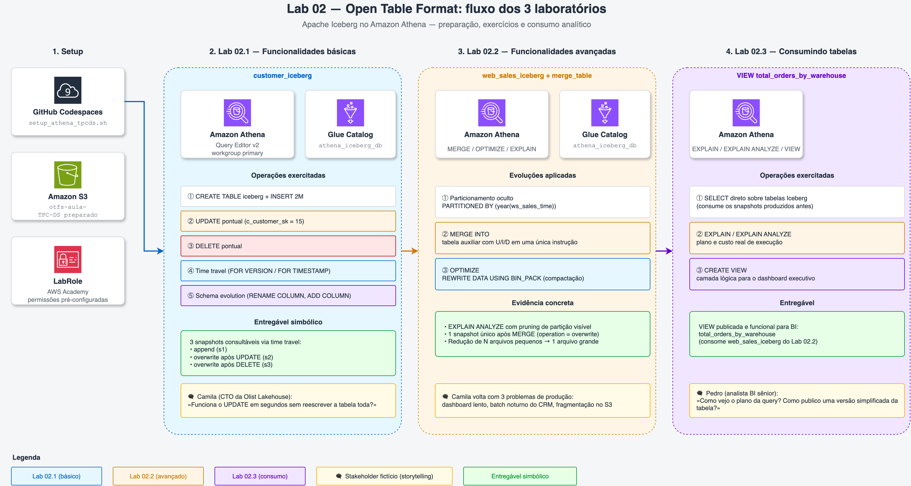

# 02 — Open Table Format

Módulo prático sobre **Apache Iceberg no Amazon Athena** — o formato de tabela aberta que transforma um data lake comum (arquivos Parquet no S3) em algo com semântica de banco analítico: `INSERT`, `UPDATE`, `DELETE`, time travel, evolução de esquema, governança.

São **3 laboratórios sequenciais**, todos rodando sobre a mesma infraestrutura preparada por `setup_athena_tpcds.sh`.

## Arquitetura do módulo

A imagem abaixo mostra o fluxo completo do módulo: setup, os 3 laboratórios em sequência, os entregáveis simbólicos de cada um e os personagens-narrador (Camila e Pedro, da Olist Lakehouse fictícia).

Fonte editável: [`img/arquitetura-02.drawio`](img/arquitetura-02.drawio) (abrir em [app.diagrams.net](https://app.diagrams.net) ou no draw.io Desktop).

## Os 3 laboratórios

| # | Laboratório | O que você faz | Tempo estimado |
|---|-------------|----------------|----------------|
| **02.1** | **[Funcionalidades básicas](01-Funcionalidades-Basicas/README.md)** | Cria a tabela `customer_iceberg`, carrega 2M registros TPC-DS, exercita `INSERT` / `UPDATE` / `DELETE` / time travel / evolução de esquema. | 60-90 min |
| **02.2** | **[Funcionalidades avançadas](02-Funcionalidades-avancadas/README.md)** | Aplica 3 evoluções na tabela `web_sales_iceberg`: particionamento oculto, `MERGE INTO` (sincronizar U/I/D em batch), `OPTIMIZE` (compactar arquivos pequenos). | 45-70 min |
| **02.3** | **[Consumindo tabelas](03-Consumindo-tabelas/README.md)** | Coloca o chapéu do analista de BI: consulta tabelas Iceberg, usa `EXPLAIN`/`EXPLAIN ANALYZE` para investigar performance, cria `VIEW` para encapsular regras. | 20-35 min |

> [!TIP]
> Cada lab depende do anterior. Faça na ordem: 02.1 → 02.2 → 02.3.

## Storytelling: a empresa fictícia "Olist Lakehouse"

Para amarrar os 3 labs, criamos uma narrativa de e-commerce brasileiro fictício:

- **Camila** (líder de plataforma de dados) — abre os labs **02.1** (migração Hive → Iceberg) e **02.2** (3 problemas de produção)
- **Pedro** (analista de BI sênior) — abre o lab **02.3** com 2 perguntas pré-dashboard

Cada lab vira **uma resposta concreta** a uma demanda real de negócio. Isso ajuda você a entender **por que** cada funcionalidade do Iceberg existe, não só **como** rodar o SQL.

## Pré-requisitos

Antes de começar **qualquer** lab deste módulo:

- [ ] Setup inicial concluído ([`00-create-codespaces`](../00-create-codespaces/README.md))
- [ ] Credenciais AWS atualizadas no Codespaces
- [ ] Bucket `base-config-<SEU RM>` existe no S3 (criado no setup)
- [ ] Você consegue acessar o [console do Amazon Athena](https://us-east-1.console.aws.amazon.com/athena/home?region=us-east-1)

O **primeiro passo do lab 02.1** roda `setup_athena_tpcds.sh` na raiz do repo, que prepara o ambiente TPC-DS no S3 e no Athena. Esse script roda uma única vez e atende os 3 labs.

## Decisões pedagógicas

Algumas decisões que valem registrar:

1. **Por que Iceberg e não Delta/Hudi?** Athena tem suporte nativo a Iceberg v2 — zero dependência extra. Delta/Hudi exigiriam EMR/Spark, fora de escopo do Learner Lab.
2. **Por que TPC-DS e não TPC-H?** TPC-DS tem mais variedade de tabelas (24 vs. 8) e cenários analíticos mais ricos para os 3 labs. O Lab 03 usa TPC-H justamente porque foca em modelagem dimensional clássica, e TPC-H tem o esquema canônico.
3. **Por que Athena e não Spark/EMR?** Athena é **serverless** (pay-per-query), elimina infraestrutura, e tem o melhor suporte declarativo a Iceberg dentro da AWS. Custo baixo e zero operação para o aluno.

## Custo do módulo

Tudo neste módulo é serverless ou pay-per-use:

- **Athena**: $5 por TB processado (queries do lab processam <1 GB cada, custo desprezível)
- **S3**: ~$0,023/GB-mês (~10 GB de dados → ~$0,23/mês)
- **Glue Data Catalog**: grátis até 1M objetos (estamos longe disso)

**Sem cluster pago para se preocupar.** Mesmo se esquecer tudo ligado por 1 mês, custa <$1.

> [!CAUTION]
> Ao final do módulo, é boa prática limpar os artefatos. Instruções no [Lab 02.3 → Próximo passo](03-Consumindo-tabelas/README.md#próximo-passo).

## Próximo módulo

Após concluir os 3 labs deste módulo, prossiga para:

**[03 — Data Modeling e Data Warehouse](../03-Data-Modeling-e-Data-Warehouse/README.md)** — modelagem dimensional clássica (star schema) no Amazon Redshift com dataset TPC-H SF10.
