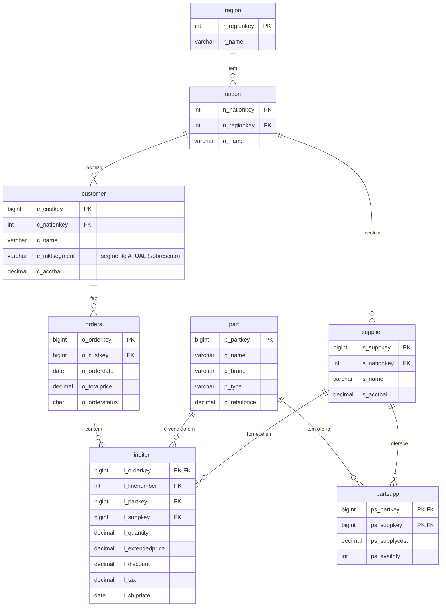
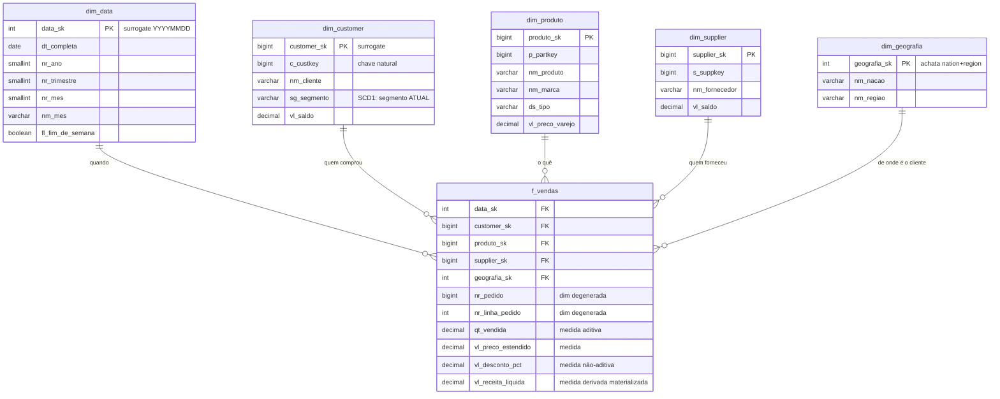
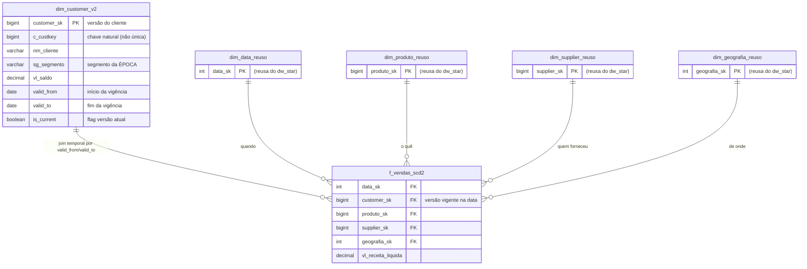
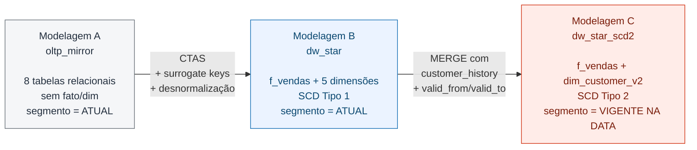

# 03.2 - Do OLTP ao Star Schema: três modelagens, três respostas

> **O cenário que vamos viver hoje.**
> Imagine que você é engenheiro de dados na **TPCH Trading**, uma distribuidora B2B com sede em São Paulo. Sua diretora financeira, **Marina**, te procura no Slack:
>
> > *— "Preciso fechar a apresentação para o conselho de segunda. Quanto faturamos em 1995, **somente com clientes do segmento AUTOMOBILE**, dividido por região? O CEO vai abrir falando dos 30 anos da empresa e quer destacar essa receita."*
>
> Parece simples. Você roda a query no banco operacional. Resposta sai em 8 segundos. Manda o número para Marina.
>
> Na segunda às 9h, antes da reunião, ela escreve de novo:
>
> > *— "Você consegue rodar essa mesma query usando a base do data warehouse novo? O time de BI está montando os dashboards lá e quero validar se os números batem."*
>
> Você roda no DW. **O número não bate.**
>
> Ela liga.

Esse é o cenário que vamos explorar juntos durante a aula. Você vai acompanhar o professor passo a passo, respondendo **exatamente a mesma pergunta de negócio** em três modelagens diferentes da mesma base, observar que os números divergem, e entender por que cada divergência tem uma justificativa legítima. No final, vamos preencher juntos um `DECISION.md` que justifica a escolha para Marina e o conselho — **simulando o que um engenheiro de dados produz na vida real quando precisa defender uma escolha de modelagem**.

> [!WARNING]
> **Pré-requisitos obrigatórios antes de começar:**
>
> - [ ] Credenciais AWS do Academy atualizadas no Codespaces — ver [Preparando Credenciais](../../00-create-codespaces/Inicio-de-aula.md)
> - [ ] Cluster Redshift `dw-aula3-<short_id>` em status `available` (Lab [03.1 · Provisionamento](../01-provisionamento/README.md) executado)
> - [ ] Dataset TPC-H carregado em `s3://dw-lab-<ACCOUNT_ID>/raw/tpch/` (`load_tpch.sh` rodado com sucesso)
> - [ ] Você consegue conectar no Query Editor v2 ou via psql no Codespaces
>
> **Valide rapidamente listando os 9 prefixos esperados no S3:**
>
> ```bash
> aws s3 ls "s3://dw-lab-$(aws sts get-caller-identity --query Account --output text)/raw/tpch/"
> ```
>
> Esperado: `customer/`, `customer_history/`, `lineitem/`, `nation/`, `orders/`, `part/`, `partsupp/`, `region/`, `supplier/`. Se faltar algum, volte ao Lab 03.1 e rode `bash scripts/load_tpch.sh` novamente.

## O que você vai fazer

Três schemas no mesmo cluster Redshift, a mesma query-âncora rodada nos três, **três números diferentes**. Tempo estimado: **75–100 min** em cluster `ra3.large` × 2 nós (execução pura ~14 min + tempo para você ler, copiar comandos, observar resultados e refletir; o `COPY` da Modelagem A leva ~9 min só para `lineitem` por causa dos 60M linhas em SF10).

- **Modelagem A** (`oltp_mirror`) — cópia fiel do OLTP → produz `N₁`
- **Modelagem B** (`dw_star`) — star schema SCD Tipo 1 → produz `N₂ ≈ N₁`
- **Modelagem C** (`dw_star_scd2`) — star schema SCD Tipo 2 → produz `N₃ ≠ N₁`
- **Decisão final** — preencher `DECISION.md` (estilo ADR) escolhendo qual modelagem você levaria para produção

## Arquitetura


O diagrama mostra o fluxo: (1) o dataset TPC-H carregado no Lab 03.1 alimenta via `COPY` o schema `oltp_mirror` (Modelagem A), (2) a partir dele são derivados o `dw_star` com SCD1 (Modelagem B) e o `dw_star_scd2` com SCD2 (Modelagem C), e (3) a mesma query-âncora rodada nos três schemas produz três números (N₁, N₂ ≈ N₁, N₃ ≠ N₁). A faixa inferior explica **por que** N₃ diverge.

Fonte editável: [`img/arquitetura-03-1.drawio`](img/arquitetura-03-1.drawio).

## Principais pontos de aprendizagem

- diferenciar modelo operacional (OLTP) de modelo analítico (star schema)
- declarar o `grain` de uma tabela fato e entender o impacto
- criar dimensões desnormalizadas com surrogate keys
- aplicar SCD Tipo 1 e Tipo 2 e observar consequências numéricas
- usar `DISTKEY`, `SORTKEY` e `DISTSTYLE ALL` no Redshift
- materializar cálculos de negócio em coluna vs. calcular on-the-fly

## O que você terá ao final

Ao final deste laboratório, você terá implementado três modelagens do mesmo dataset TPC-H no mesmo cluster Redshift, executado a mesma query-âncora nas três, obtido três números diferentes e escrito um documento curto defendendo a modelagem escolhida.

> [!TIP]
> Sempre que encontrar um bloco com o título **💡 Clique para entender**, abra esse trecho. Ele traz explicação detalhada do comando, contexto prático da aula e links oficiais para aprofundamento.

## Mapa do lab

| Parte | O que você faz | Passos | Tempo |
|-------|----------------|--------|-------|
| [Parte 1](#parte-1---acessando-o-redshift-pelo-query-editor-v2) | Acessa o Redshift pelo Query Editor v2 | [1](#passo-1) · [2](#passo-2) · [3](#passo-3) · [4](#passo-4) | ~5 min |
| [Parte 2](#parte-2---modelagem-a-espelho-do-oltp) | Modelagem A — espelho OLTP → produz `N₁` | [5](#passo-5) · [6](#passo-6) · [7](#passo-7) · [8](#passo-8) · [9](#passo-9) · [10](#passo-10) | ~30 min |
| [Parte 3](#parte-3---modelagem-b-star-schema-com-scd-tipo-1) | Modelagem B — star schema SCD1 → produz `N₂` | [11](#passo-11) · [12](#passo-12) · [13](#passo-13) · [14](#passo-14)([a](#passo-14a)·[b](#passo-14b)·[c](#passo-14c)·[d](#passo-14d)) · [15](#passo-15) · [16](#passo-16) · [17](#passo-17) · [18](#passo-18) | ~25 min |
| [Parte 4](#parte-4---modelagem-c-star-schema-com-scd-tipo-2) | Modelagem C — star schema SCD2 → produz `N₃` | [19](#passo-19) · [20](#passo-20) · [21](#passo-21) · [22](#passo-22) · [23](#passo-23) · [24](#passo-24) · [25](#passo-25) | ~20 min |
| [Parte 5](#parte-5---comparando-os-três-resultados) | Compara `N₁`, `N₂`, `N₃` e escreve `DECISION.md` | [26](#passo-26) · [27](#passo-27) · [28](#passo-28) | ~10 min |

> [!TIP]
> Se travou em algum passo, você pode pular direto: clique no número do passo na coluna **Passos** acima.

<details>
<summary><b>💡 Não viu a aula ainda? O que é um Data Warehouse em 3 parágrafos</b></summary>
<blockquote>

Um **Data Warehouse (DW)** é um banco de dados pensado para **responder perguntas de negócio**, não para atender transações. A mesma tabela `orders` em um banco OLTP (sistema de checkout) responde a perguntas como "qual o status do pedido 12345?". No DW, ela entra em um **fato** `f_vendas` que responde "qual foi a receita por região × mês × segmento em 1995?".

A diferença não é cosmética — é de **escolha física e lógica**:

| Dimensão | OLTP (transacional) | DW (analítico) |
|----------|---------------------|----------------|
| Otimizado para | leituras/escritas pontuais (1 pedido) | leituras agregadas (milhões de pedidos) |
| Modelagem | 3NF, muitas tabelas pequenas | star/snowflake, poucas tabelas largas |
| Armazenamento | row-based | columnar (Redshift, BigQuery, Snowflake) |
| Join | chave primária, 1 registro | chave surrogate, milhões de registros |
| Atualização | constante (milhares por segundo) | em lote (diário/horário) |
| Query típica | `SELECT * FROM orders WHERE id = ?` | `SELECT SUM(revenue) GROUP BY region, year` |

Neste lab você vai sentir essa diferença **numericamente**: a mesma pergunta ("quanto faturou o segmento AUTOMOBILE em 1995?") produz **três respostas diferentes** dependendo da escolha de modelagem. Não porque uma está errada, mas porque cada modelagem materializa um contrato semântico distinto. Esse é o ponto central do curso.

Referências rápidas:
- *The Data Warehouse Toolkit* (Kimball) — bíblia de modelagem dimensional
- [Amazon Redshift Best Practices — data modeling](https://docs.aws.amazon.com/redshift/latest/dg/c_best-practices-choose-sort-keys.html)

</blockquote>
</details>

---

## Contexto

A tese central deste lab é que **a mesma pergunta de negócio pode produzir respostas diferentes quando a modelagem muda**. Isso não é bug — é consequência de contratos semânticos distintos. Entender isso separa um engenheiro de dados que "move arquivos" de um que "constrói produtos analíticos confiáveis".

### A pergunta-âncora

Esta é a única pergunta de negócio que você vai responder neste lab, mas você vai respondê-la três vezes:

> **"Qual foi a receita líquida total do segmento `AUTOMOBILE` no ano de 1995, agrupada por região do cliente?"**

A fórmula contratual da receita líquida, herdada do benchmark TPC-H, é `l_extendedprice × (1 - l_discount)`.

### As três modelagens

| Modelagem | Schema | Característica |
|-----------|--------|----------------|
| **A** — Espelho OLTP | `oltp_mirror` | Cópia fiel das 8 tabelas TPC-H |
| **B** — Star Schema SCD1 | `dw_star` | Fato + dimensões; `dim_customer` guarda segmento **atual** |
| **C** — Star Schema SCD2 | `dw_star_scd2` | Mesmo do B, mas `dim_customer` preserva **histórico** de segmento |

### Modelo de dados comparado — ao nível de tabelas, colunas e relacionamentos

Os três diagramas abaixo mostram **exatamente o mesmo dado físico** representado de formas diferentes. Observe que:

- Na **Modelagem A**, não existe fato nem dimensão — só 8 tabelas relacionais espelhando o OLTP. A lógica analítica é inteiramente construída na query.
- Nas **Modelagens B e C**, os conceitos `FATO` e `DIMENSÃO` aparecem explicitamente (anotados nos diagramas). A fato concentra medidas; as dimensões concentram contexto descritivo.
- A diferença entre B e C está **em uma única tabela**: `dim_customer`. No B ela tem 1,5M linhas (SCD1); no C tem ~1,575M linhas versionadas (SCD2) com colunas temporais.

#### Modelagem A · `oltp_mirror` (relacional, sem distinção fato/dimensão)



> [!NOTE]
> **Nenhuma tabela é "fato" aqui.** A query da Modelagem A precisa juntar 5 tabelas e aplicar filtros em colunas espalhadas (data em `orders`, segmento em `customer`, região em `region`). Isso funciona para poucas consultas, mas expõe o usuário ao modelo operacional inteiro.

#### Modelagem B · `dw_star` (Star Schema com SCD Tipo 1)



> [!IMPORTANT]
> **`f_vendas` é a FATO** (centro da estrela). As demais são **DIMENSÕES** (pontas da estrela). Grain declarado: *uma linha = um item (`l_linenumber`) de um pedido (`l_orderkey`)*.
>
> - **Surrogate keys** (`_sk`) isolam o warehouse de mudanças nas chaves naturais.
> - **Medidas** ficam na fato (`qt_vendida`, `vl_receita_liquida`). **Atributos** ficam nas dimensões (`sg_segmento`, `nm_marca`, `nm_regiao`).
> - `dim_geografia` **achata** `nation + region` (star clássico; evita snowflake).
> - `vl_receita_liquida` está **materializada** na fato (contrato explícito da fórmula TPC-H).

#### Modelagem C · `dw_star_scd2` (Star Schema com SCD Tipo 2)



> [!IMPORTANT]
> **A única diferença estrutural para a Modelagem B** é que `dim_customer` agora pode ter **múltiplas linhas por cliente** — uma por período de vigência do segmento. A chave natural `c_custkey` **deixa de ser única** na dimensão; o `customer_sk` identifica a **versão** (não a entidade).
>
> O join da fato com a dimensão passa a carregar um predicado temporal:
>
> ```sql
> JOIN dim_customer_v2 c
>   ON c.c_custkey = o.o_custkey
>  AND o.o_orderdate BETWEEN c.valid_from AND c.valid_to
> ```
>
> As outras 4 dimensões (`dim_data`, `dim_produto`, `dim_supplier`, `dim_geografia`) são **reaproveitadas** do `dw_star` — aqui estão marcadas como `*_reuso` apenas para deixar a origem visível.

#### Resumindo o que mudou entre as 3 modelagens



---

## Parte 1 - Acessando o Redshift pelo Query Editor v2

### Resultado esperado desta parte

Ao final desta etapa, você estará conectado ao cluster Redshift pelo editor de consultas do console AWS, com o banco `dw_mba` selecionado e pronto para receber comandos SQL.

---

<a id="passo-1"></a>

1. Abra o [console do Amazon Redshift Query Editor v2](https://us-east-1.console.aws.amazon.com/sqlworkbench/home?region=us-east-1#/client).

<!-- PRINT SUGERIDO: img/redshift_query_editor_landing.png
     Tela inicial do Query Editor v2 no console AWS, mostrando a árvore de clusters à esquerda.
     Captura a janela inteira do browser com o editor ainda sem conexão feita. -->


---

<a id="passo-2"></a>

2. Clique com o botão direito no cluster `dw-aula3-<SHORT_ID>` e escolha **Create connection**.

<!-- PRINT SUGERIDO: img/redshift_create_connection.png
     Menu de contexto aberto no cluster, destacando a opção "Create connection".
     Use zoom na árvore lateral esquerda para o cluster + menu aparecerem juntos. -->


---

<a id="passo-3"></a>

3. Na caixa de autenticação, escolha **Database user name and password** e preencha:
   - Database: `dw_mba`
   - Username: `dwadmin`
   - Password: o valor retornado por `terraform output -raw redshift_master_password` (no Codespaces, na pasta `01-provisionamento/`)

<!-- PRINT SUGERIDO: img/redshift_connection_form.png
     Caixa de autenticação preenchida (com a senha coberta/borrada).
     Mostra os 3 campos: Database, Username, Password. -->


---

<a id="passo-4"></a>

4. Teste a conexão executando:

```sql
SELECT current_database(), current_user, version();
```

O resultado deve retornar `dw_mba`, `dwadmin` e a versão do Redshift.

<!-- PRINT SUGERIDO: img/redshift_first_query.png
     Resultado da query com as 3 colunas preenchidas no painel Results do editor. -->


### Checkpoint

Se você chegou até aqui, então:

- a conexão com o cluster está aberta
- o banco `dw_mba` está selecionado
- você pode executar SQL daqui para frente

---

## Parte 2 - Modelagem A: espelho do OLTP

> **Vamos começar pelo cenário mais simples**: o time de dados subiu o Redshift na semana passada e a primeira coisa que fez foi **espelhar literalmente** o banco operacional. Sem transformar, sem modelar. É como muitas empresas começam — vamos sentir as consequências disso na pele.

### Por que essa modelagem existe

| Aspecto | Resposta curta |
|---------|----------------|
| **Problema de negócio** | A empresa migrou para o Redshift e o time de dados quer responder perguntas analíticas **sem** montar nenhum modelo dimensional novo. Espelham o OLTP literalmente, banco por banco, tabela por tabela. |
| **Pergunta que ela responde bem** | *"Qual é o status atual do pedido X?"* — o DW vira um leitor secundário do OLTP, sem perda de fidelidade. |
| **Pergunta que ela responde mal** | *"Qual a receita por região × mês × segmento em 1995?"* — exige 5 joins entre tabelas grandes, demora muito, e é difícil garantir consistência semântica entre analistas (cada um aplica fórmulas diferentes). |
| **Quando acontece na vida real** | Nas primeiras semanas após "subir o DW" — antes de modelar. É um modo de transição comum que muitas empresas mantêm permanentemente por inércia. |

### Resultado esperado desta parte

Ao final desta parte, as 8 tabelas do TPC-H estarão criadas no schema `oltp_mirror` e carregadas via `COPY FROM S3`. A query-âncora terá produzido o **primeiro número (`N₁`)** — o número que respondemos para Marina na primeira tentativa.

---

<a id="passo-5"></a>

5. Crie o schema e as 8 tabelas TPC-H. Este schema reproduz o modelo relacional operacional, sem qualquer transformação analítica:

```sql
DROP SCHEMA IF EXISTS oltp_mirror CASCADE;
CREATE SCHEMA oltp_mirror;

CREATE TABLE oltp_mirror.region (
    r_regionkey INTEGER     NOT NULL PRIMARY KEY,
    r_name      VARCHAR(25) NOT NULL,
    r_comment   VARCHAR(152)
)
DISTSTYLE ALL;

CREATE TABLE oltp_mirror.nation (
    n_nationkey INTEGER     NOT NULL PRIMARY KEY,
    n_name      VARCHAR(25) NOT NULL,
    n_regionkey INTEGER     NOT NULL,
    n_comment   VARCHAR(152)
)
DISTSTYLE ALL;

CREATE TABLE oltp_mirror.customer (
    c_custkey    BIGINT        NOT NULL PRIMARY KEY,
    c_name       VARCHAR(25)   NOT NULL,
    c_address    VARCHAR(40)   NOT NULL,
    c_nationkey  INTEGER       NOT NULL,
    c_phone      VARCHAR(15)   NOT NULL,
    c_acctbal    DECIMAL(15,2) NOT NULL,
    c_mktsegment VARCHAR(10)   NOT NULL,
    c_comment    VARCHAR(117)  NOT NULL
)
DISTSTYLE AUTO;

CREATE TABLE oltp_mirror.supplier (
    s_suppkey   BIGINT        NOT NULL PRIMARY KEY,
    s_name      VARCHAR(25)   NOT NULL,
    s_address   VARCHAR(40)   NOT NULL,
    s_nationkey INTEGER       NOT NULL,
    s_phone     VARCHAR(15)   NOT NULL,
    s_acctbal   DECIMAL(15,2) NOT NULL,
    s_comment   VARCHAR(101)  NOT NULL
)
DISTSTYLE AUTO;

CREATE TABLE oltp_mirror.part (
    p_partkey     BIGINT        NOT NULL PRIMARY KEY,
    p_name        VARCHAR(55)   NOT NULL,
    p_mfgr        VARCHAR(25)   NOT NULL,
    p_brand       VARCHAR(10)   NOT NULL,
    p_type        VARCHAR(25)   NOT NULL,
    p_size        INTEGER       NOT NULL,
    p_container   VARCHAR(10)   NOT NULL,
    p_retailprice DECIMAL(15,2) NOT NULL,
    p_comment     VARCHAR(23)   NOT NULL
)
DISTSTYLE AUTO;

CREATE TABLE oltp_mirror.partsupp (
    ps_partkey    BIGINT        NOT NULL,
    ps_suppkey    BIGINT        NOT NULL,
    ps_availqty   INTEGER       NOT NULL,
    ps_supplycost DECIMAL(15,2) NOT NULL,
    ps_comment    VARCHAR(199)  NOT NULL,
    PRIMARY KEY (ps_partkey, ps_suppkey)
)
DISTSTYLE AUTO;

CREATE TABLE oltp_mirror.orders (
    o_orderkey      BIGINT        NOT NULL PRIMARY KEY,
    o_custkey       BIGINT        NOT NULL,
    o_orderstatus   CHAR(1)       NOT NULL,
    o_totalprice    DECIMAL(15,2) NOT NULL,
    o_orderdate     DATE          NOT NULL,
    o_orderpriority VARCHAR(15)   NOT NULL,
    o_clerk         VARCHAR(15)   NOT NULL,
    o_shippriority  INTEGER       NOT NULL,
    o_comment       VARCHAR(79)   NOT NULL
)
DISTKEY (o_custkey)
SORTKEY (o_orderdate);

CREATE TABLE oltp_mirror.lineitem (
    l_orderkey      BIGINT        NOT NULL,
    l_partkey       BIGINT        NOT NULL,
    l_suppkey       BIGINT        NOT NULL,
    l_linenumber    INTEGER       NOT NULL,
    l_quantity      DECIMAL(15,2) NOT NULL,
    l_extendedprice DECIMAL(15,2) NOT NULL,
    l_discount      DECIMAL(15,2) NOT NULL,
    l_tax           DECIMAL(15,2) NOT NULL,
    l_returnflag    CHAR(1)       NOT NULL,
    l_linestatus    CHAR(1)       NOT NULL,
    l_shipdate      DATE          NOT NULL,
    l_commitdate    DATE          NOT NULL,
    l_receiptdate   DATE          NOT NULL,
    l_shipinstruct  VARCHAR(25)   NOT NULL,
    l_shipmode      VARCHAR(10)   NOT NULL,
    l_comment       VARCHAR(44)   NOT NULL,
    PRIMARY KEY (l_orderkey, l_linenumber)
)
DISTKEY (l_orderkey)
SORTKEY (l_shipdate);
```

<!-- PRINT SUGERIDO: img/oltp_create_schema_success.png
     Painel "Query executed successfully" após rodar o CREATE SCHEMA + todos os CREATE TABLE.
     Capturar a mensagem de sucesso + a árvore lateral mostrando o schema novo. -->


<details>
<summary><b>💡 Clique para entender: escolhas físicas do schema OLTP mirror</b></summary>
<blockquote>

Mesmo que esta modelagem seja uma "cópia fiel" do operacional, ainda escolhemos chaves de distribuição e ordenação — porque o Redshift sempre precisa distribuir e ordenar dados entre slices. As decisões aqui são:

### Por que `DISTSTYLE ALL` em `region` e `nation`

São tabelas muito pequenas (5 e 25 linhas). Replicar integralmente em todos os slices elimina qualquer necessidade de redistribuição em joins. O custo em storage é desprezível.

### Por que `DISTSTYLE AUTO` em customer/supplier/part/partsupp

O Redshift analisa o tamanho e o padrão de uso e escolhe dinamicamente entre `ALL`, `EVEN` e `KEY`. Para tabelas médias, `AUTO` costuma ser o padrão mais seguro quando ainda não há workload estabilizado.

### Por que `DISTKEY` em `orders.o_custkey` e `lineitem.l_orderkey`

Essas são as duas tabelas grandes. Elas se unem entre si por `o_orderkey = l_orderkey`, então distribuir `orders` por `o_orderkey` e `lineitem` por `l_orderkey` colocaria as mesmas chaves no mesmo slice — mas preferimos distribuir `orders` por `o_custkey` porque a query-âncora junta pesado com `customer`. Essa é uma decisão que muda conforme o workload dominante.

### Por que `SORTKEY` em colunas de data

Sort keys em data habilitam **zone map pruning**: o Redshift armazena min/max por bloco e pode pular blocos inteiros quando a query tem filtro por faixa de data. O ganho é enorme em consultas como "vendas de 1995" — exatamente a nossa query-âncora.

Documentação oficial:
- [Choosing a data distribution style](https://docs.aws.amazon.com/redshift/latest/dg/c_choosing_dist_sort.html)
- [Sort keys](https://docs.aws.amazon.com/redshift/latest/dg/t_Sorting_data.html)

</blockquote>
</details>

---

<a id="passo-6"></a>

6. Antes de carregar dados, descubra seu Account ID para montar a URL do S3:

```sql
SELECT current_user_id() AS user, current_aws_account() AS account_id;
```

<!-- PRINT SUGERIDO: img/redshift_account_id.png
     Resultado da query mostrando o account_id. Usuário vai copiar esse valor para os próximos COPY. -->


---

<a id="passo-7"></a>

7. Carregue as 8 tabelas usando `COPY FROM S3`. **Em todos os blocos abaixo, substitua `<SEU_ACCOUNT_ID>` pelo valor obtido no passo 6**. Dividimos em 3 lotes: pequenas → médias → grandes (fatos). Rode e valide cada lote antes de seguir — é mais fácil descobrir qual tabela falhou se algo der errado.

**Lote 1/3 — tabelas de referência (rápido, 2 tabelas, poucas linhas):**

```sql
COPY oltp_mirror.region
FROM 's3://dw-lab-<SEU_ACCOUNT_ID>/raw/tpch/region/'
IAM_ROLE default
FORMAT AS CSV DELIMITER '|'
COMPUPDATE OFF
STATUPDATE OFF;

COPY oltp_mirror.nation
FROM 's3://dw-lab-<SEU_ACCOUNT_ID>/raw/tpch/nation/'
IAM_ROLE default
FORMAT AS CSV DELIMITER '|'
COMPUPDATE OFF
STATUPDATE OFF;

-- Checkpoint do lote 1: deve retornar region=5, nation=25
SELECT 'region' AS tbl, COUNT(*) AS linhas FROM oltp_mirror.region
UNION ALL SELECT 'nation', COUNT(*) FROM oltp_mirror.nation;
```

<!-- PRINT SUGERIDO: img/copy_lote_1_sucesso.png
     Mensagens dos 2 COPYs ("INFO: Load into table 'region' completed, 5
     record(s) loaded...") + resultado do checkpoint mostrando region=5,
     nation=25. Primeiro COPY do lab — aluno reconhece o padrao para os
     proximos 7. -->


**Lote 2/3 — mestres (médio, 4 tabelas, até 800k linhas):**

```sql
COPY oltp_mirror.customer
FROM 's3://dw-lab-<SEU_ACCOUNT_ID>/raw/tpch/customer/'
IAM_ROLE default
FORMAT AS CSV DELIMITER '|'
COMPUPDATE OFF
STATUPDATE OFF;

COPY oltp_mirror.supplier
FROM 's3://dw-lab-<SEU_ACCOUNT_ID>/raw/tpch/supplier/'
IAM_ROLE default
FORMAT AS CSV DELIMITER '|'
COMPUPDATE OFF
STATUPDATE OFF;

COPY oltp_mirror.part
FROM 's3://dw-lab-<SEU_ACCOUNT_ID>/raw/tpch/part/'
IAM_ROLE default
FORMAT AS CSV DELIMITER '|'
COMPUPDATE OFF
STATUPDATE OFF;

COPY oltp_mirror.partsupp
FROM 's3://dw-lab-<SEU_ACCOUNT_ID>/raw/tpch/partsupp/'
IAM_ROLE default
FORMAT AS CSV DELIMITER '|'
COMPUPDATE OFF
STATUPDATE OFF;

-- Checkpoint do lote 2: customer=1500000, supplier=100000, part=2000000, partsupp=8000000
SELECT 'customer' AS tbl, COUNT(*) AS linhas FROM oltp_mirror.customer
UNION ALL SELECT 'supplier', COUNT(*) FROM oltp_mirror.supplier
UNION ALL SELECT 'part',     COUNT(*) FROM oltp_mirror.part
UNION ALL SELECT 'partsupp', COUNT(*) FROM oltp_mirror.partsupp;
```

**Lote 3/3 — transacionais (lento, 2 tabelas, até 6M linhas):**

```sql
COPY oltp_mirror.orders
FROM 's3://dw-lab-<SEU_ACCOUNT_ID>/raw/tpch/orders/'
IAM_ROLE default
FORMAT AS CSV DELIMITER '|'
COMPUPDATE OFF
STATUPDATE OFF;

COPY oltp_mirror.lineitem
FROM 's3://dw-lab-<SEU_ACCOUNT_ID>/raw/tpch/lineitem/'
IAM_ROLE default
FORMAT AS CSV DELIMITER '|'
COMPUPDATE OFF
STATUPDATE OFF;

-- Checkpoint do lote 3: orders=15.000.000, lineitem=59.986.052
SELECT 'orders'   AS tbl, COUNT(*) AS linhas FROM oltp_mirror.orders
UNION ALL SELECT 'lineitem', COUNT(*) FROM oltp_mirror.lineitem;
```

> [!TIP]
> `lineitem` é a maior tabela (~7,2 GB de texto SF10, ~60M linhas) e demora **~6 min** no cluster com 2 nós + `COMPUPDATE OFF`. `orders` (~15M linhas) leva **~1m30**. Se parecer travado, confira no console Redshift se a query ainda está rodando — não cancele antes.

<details>
<summary><b>💡 Clique para entender: o comando COPY no Redshift</b></summary>
<blockquote>

O `COPY` é a forma canônica de carregar grandes volumes para o Redshift. Ele é muito mais eficiente do que `INSERT` linha a linha porque usa a arquitetura MPP para paralelizar a leitura entre slices.

### Anatomia do comando

- `FROM 's3://...'` aponta para o prefixo no S3. O Redshift lista todos os arquivos sob o prefixo e distribui entre os slices.
- `IAM_ROLE default` diz "use a role padrão do cluster". No Terraform do Lab 03, configuramos `default_iam_role_arn = LabRole`, então nunca precisamos colar ARN explícito.
- `FORMAT AS CSV DELIMITER '|'` informa que o arquivo é texto delimitado por `|` — formato nativo do TPC-H. Cada linha do arquivo vira uma linha da tabela; ordem das colunas no arquivo deve bater com a ordem no `CREATE TABLE`.
- `COMPUPDATE OFF` desliga a análise automática de encoding de colunas. Em tabelas pequenas isso é útil para o Redshift escolher compressão; em tabelas grandes a análise demora mais que a carga em si. Para laboratório (cluster descartável), sempre desligar.
- `STATUPDATE OFF` desliga atualização automática de estatísticas. Vamos rodar `ANALYZE` explicitamente no passo seguinte — fica mais didático e mais rápido.

### Por que CSV e não Parquet

O dataset TPC-H está em formato `.tbl` (texto delimitado por `|`) no bucket público da AWS. Mantemos o formato original — copiar para o bucket do aluno é S3-to-S3 e leva ~2 min em vez dos ~30 min que pandas+pyarrow gastariam para converter para Parquet localmente. **No mundo real**, ETLs em produção convertem para Parquet uma vez e armazenam — esse é o ponto da próxima aula (Lakehouse).

### Por que não usar `INSERT SELECT` a partir de uma tabela externa

Em ambientes onde Spectrum está disponível, você poderia criar uma external table e usar `INSERT SELECT`. Mas o `COPY` é mais rápido porque lê e escreve em paralelo por slice, sem passar pelo otimizador de query como uma leitura convencional.

### Paralelismo implícito

Cada slice do cluster puxa uma parte do arquivo via byte-range. Com 2 nós × 2 slices/nó = **4 slices** processando o `lineitem.tbl` em paralelo. Em produção, splitar `lineitem` em N arquivos pequenos maximiza ainda mais o throughput — o Redshift recomenda 1 arquivo por slice no mínimo.

Documentação oficial:

- [COPY from Amazon S3](https://docs.aws.amazon.com/redshift/latest/dg/copy-parameters-data-source-s3.html)
- [COPY from CSV](https://docs.aws.amazon.com/redshift/latest/dg/copy-usage_notes-copy-from-text.html)
- [Loading data — best practices](https://docs.aws.amazon.com/redshift/latest/dg/c_loading-data-best-practices.html)

</blockquote>
</details>

---

<a id="passo-8"></a>

8. Atualize as estatísticas do otimizador (passo rápido mas importante para os planos subsequentes):

```sql
ANALYZE oltp_mirror.region;
ANALYZE oltp_mirror.nation;
ANALYZE oltp_mirror.customer;
ANALYZE oltp_mirror.supplier;
ANALYZE oltp_mirror.part;
ANALYZE oltp_mirror.partsupp;
ANALYZE oltp_mirror.orders;
ANALYZE oltp_mirror.lineitem;
```

---

<a id="passo-9"></a>

9. Confirme que os volumes batem com o TPC-H SF10. **Essa é sua primeira âncora de confiança** — se os números aqui não batem, **não siga adiante**. Qualquer divergência na query-âncora (passo 10) vai ser causada por problema aqui, e você gasta 20 minutos debugando a query para descobrir que a carga falhou:

```sql
SELECT 'region'   AS tbl, COUNT(*) AS linhas,         5 AS esperado FROM oltp_mirror.region
UNION ALL
SELECT 'nation'   AS tbl, COUNT(*) AS linhas,        25 AS esperado FROM oltp_mirror.nation
UNION ALL
SELECT 'customer' AS tbl, COUNT(*) AS linhas,   1500000 AS esperado FROM oltp_mirror.customer
UNION ALL
SELECT 'supplier' AS tbl, COUNT(*) AS linhas,    100000 AS esperado FROM oltp_mirror.supplier
UNION ALL
SELECT 'part'     AS tbl, COUNT(*) AS linhas,   2000000 AS esperado FROM oltp_mirror.part
UNION ALL
SELECT 'partsupp' AS tbl, COUNT(*) AS linhas,   8000000 AS esperado FROM oltp_mirror.partsupp
UNION ALL
SELECT 'orders'   AS tbl, COUNT(*) AS linhas,  15000000 AS esperado FROM oltp_mirror.orders
UNION ALL
SELECT 'lineitem' AS tbl, COUNT(*) AS linhas,  59986052 AS esperado FROM oltp_mirror.lineitem
ORDER BY tbl;
```

<!-- PRINT SUGERIDO: img/oltp_sanity_check.png
     Resultado das 8 linhas com "linhas" == "esperado" em todos os casos.
     Essa é a evidência de que o COPY funcionou corretamente. -->


<details>
<summary><b>⚠ Se alguma contagem não bater, o <code>COPY</code> falhou em alguma tabela</b></summary>
<blockquote>

Consulte a tabela de erros de carga do Redshift:

```sql
SELECT filename, line_number, colname, err_reason
FROM stl_load_errors
ORDER BY starttime DESC
LIMIT 10;
```

A causa mais comum é o bucket S3 estar vazio ou com caminho diferente. Confirme do terminal do Codespaces:

```bash
aws s3 ls "s3://dw-lab-$(aws sts get-caller-identity --query Account --output text)/raw/tpch/" --recursive
```

Se o bucket estiver vazio, volte para o Lab 03.1 e rode `bash scripts/load_tpch.sh` novamente.

</blockquote>
</details>

---

<a id="passo-10"></a>

10. Execute a query-âncora pela primeira vez, no modelo OLTP:

```sql
SELECT
    r.r_name                                                 AS region_name,
    ROUND(SUM(l.l_extendedprice * (1 - l.l_discount)), 2)    AS receita_liquida_1995_automobile,
    COUNT(*)                                                 AS qtd_itens,
    COUNT(DISTINCT o.o_custkey)                              AS qtd_clientes_distintos
FROM oltp_mirror.lineitem l
JOIN oltp_mirror.orders   o ON o.o_orderkey = l.l_orderkey
JOIN oltp_mirror.customer c ON c.c_custkey  = o.o_custkey
JOIN oltp_mirror.nation   n ON n.n_nationkey = c.c_nationkey
JOIN oltp_mirror.region   r ON r.r_regionkey = n.n_regionkey
WHERE o.o_orderdate >= DATE '1995-01-01'
  AND o.o_orderdate <  DATE '1996-01-01'
  AND c.c_mktsegment = 'AUTOMOBILE'
GROUP BY r.r_name
ORDER BY receita_liquida_1995_automobile DESC;
```

<!-- PRINT SUGERIDO: img/query_ancora_N1.png
     Resultado da query-âncora no modelo A. As 5 regiões aparecem ordenadas por receita descendente.
     Destaque o valor de AMERICA (linha superior) — é o número que o aluno vai comparar com N2 e N3. -->


> [!TIP]
> **Anote o valor de `AMERICA` como `N₁`**. Ele será comparado com `N₂` (Modelagem B) e `N₃` (Modelagem C) no final do lab.

<details>
<summary><b>💡 Clique para entender: por que esta query expõe tanta decisão de modelagem</b></summary>
<blockquote>

A query parece simples, mas cada pedaço expõe uma decisão que muda quando mudamos de modelagem:

- **5 joins** entre tabelas relacionais. No star schema (próxima parte), esse número cai para 3.
- **Filtro `o_orderdate`** espalhado em uma tabela diferente do filtro `c_mktsegment`. No star schema, ambos filtros ficam em dimensões próximas ao fato.
- **`l_extendedprice * (1 - l_discount)`** calculado on-the-fly. No star schema, vamos materializar esse cálculo.
- **`c.c_mktsegment`** lê o estado **atual** da tabela. Se um cliente foi reclassificado depois de 1995, a venda vai aparecer sob o segmento atual — não o de 1995. É aqui que a diferença SCD1 vs. SCD2 vai morder o número.

### Padrão mental

Guarde esta frase: *"No OLTP, a tabela é o retrato de AGORA. No warehouse com SCD2, a tabela pode preservar AGORA e ENTÃO."*

</blockquote>
</details>

### Checkpoint

Se você chegou até aqui, então:

- o schema `oltp_mirror` existe e tem as 8 tabelas carregadas
- a query-âncora rodou e você anotou `N₁`

---

## Parte 3 - Modelagem B: star schema com SCD Tipo 1

> **Marina não está convencida com o `N₁` que produzimos**: a query foi lenta e os analistas internos da TPCH Trading reclamam que cada um chega num número diferente quando aplica a fórmula de receita líquida. **Vamos agora construir um star schema dedicado** — modelo dimensional clássico Kimball — e rodar a mesma pergunta nele.

### Por que essa modelagem existe

| Aspecto | Resposta curta |
|---------|----------------|
| **Problema de negócio** | Analistas reclamam que rodar a query-âncora direto no `oltp_mirror` demora 30 segundos e cada um aplica fórmulas diferentes para "receita líquida". Time de BI propõe **um modelo dimensional dedicado** com fato `f_vendas` e dimensões. |
| **Pergunta que ela responde bem** | *"Receita por região × mês × segmento em 1995"* — a fato já tem grain ideal (1 linha = 1 item de pedido) e medidas materializadas (`vl_receita_liquida` calculada uma vez, lida muitas). |
| **Pergunta que ela responde mal** | *"Qual era o segmento do cliente X em 1995, antes da reclassificação?"* — SCD Tipo 1 sobrescreve atributos quando muda. Histórico se perde. |
| **Quando acontece na vida real** | Modelo "default" da maioria dos warehouses — Kimball clássico. Funciona em 80% dos casos onde o atributo dimensional **não muda** ou onde **só importa o valor atual**. |

### Resultado esperado desta parte

Ao final desta parte, o schema `dw_star` terá 5 dimensões (`dim_data`, `dim_customer`, `dim_produto`, `dim_supplier`, `dim_geografia`) e uma fato (`f_vendas`), todas com surrogate keys e estratégia física adequada. A query-âncora terá produzido **`N₂`** — o número que o time de BI está mostrando no dashboard novo.

---

<a id="passo-11"></a>

11. Crie o schema:

```sql
DROP SCHEMA IF EXISTS dw_star CASCADE;
CREATE SCHEMA dw_star;
```

<details>
<summary><b>💡 Clique para entender: o grain da fato como contrato</b></summary>
<blockquote>

Antes de qualquer tabela, é preciso declarar o **grain**:

> Uma linha de `dw_star.f_vendas` representa um item (`l_linenumber`) de um pedido (`o_orderkey`), vendido em uma data (data do pedido), para um cliente (`customer_sk`), de um produto (`produto_sk`), fornecido por um fornecedor (`supplier_sk`).

Isso é o mesmo grain da tabela `lineitem` do TPC-H. A diferença é que agora as chaves naturais foram trocadas por surrogate keys.

### Por que declarar o grain por escrito

Se uma linha da fato misturar "um item" e "um pedido inteiro" (ou pior: um item **e** um ajuste posterior do pedido), todas as agregações podem ficar duplicando ou perdendo dados. O grain é o contrato que impede isso.

### Em produção

Em um warehouse real, o grain fica documentado no catálogo de dados, no dbt `description`, em comentários da própria tabela Redshift (`COMMENT ON TABLE ... IS '...'`), e em ADRs (Architecture Decision Records).

</blockquote>
</details>

---

<a id="passo-12"></a>

12. Crie e popule a `dim_data`, cobrindo 1992-01-01 a 1998-12-31:

```sql
CREATE TABLE dw_star.dim_data (
    data_sk          INTEGER     NOT NULL PRIMARY KEY,
    dt_completa      DATE        NOT NULL,
    nr_ano           SMALLINT    NOT NULL,
    nr_trimestre     SMALLINT    NOT NULL,
    nr_mes           SMALLINT    NOT NULL,
    nm_mes           VARCHAR(15) NOT NULL,
    nr_dia           SMALLINT    NOT NULL,
    nr_dia_semana    SMALLINT    NOT NULL,
    nm_dia_semana    VARCHAR(15) NOT NULL,
    fl_fim_de_semana BOOLEAN     NOT NULL,
    nr_semana_ano    SMALLINT    NOT NULL,
    nm_ano_trimestre VARCHAR(10) NOT NULL
)
DISTSTYLE ALL
SORTKEY (dt_completa);

INSERT INTO dw_star.dim_data
WITH numeros AS (
    SELECT ROW_NUMBER() OVER () - 1 AS n
    FROM stl_plan_info
    LIMIT 2557
),
datas AS (
    SELECT DATEADD(day, n, DATE '1992-01-01') AS dt
    FROM numeros
)
SELECT
    CAST(TO_CHAR(dt, 'YYYYMMDD') AS INTEGER) AS data_sk,
    dt                                       AS dt_completa,
    EXTRACT(YEAR    FROM dt)                 AS nr_ano,
    EXTRACT(QUARTER FROM dt)                 AS nr_trimestre,
    EXTRACT(MONTH   FROM dt)                 AS nr_mes,
    TRIM(TO_CHAR(dt, 'Month'))               AS nm_mes,
    EXTRACT(DAY     FROM dt)                 AS nr_dia,
    EXTRACT(DOW     FROM dt)                 AS nr_dia_semana,
    TRIM(TO_CHAR(dt, 'Day'))                 AS nm_dia_semana,
    CASE WHEN EXTRACT(DOW FROM dt) IN (0,6) THEN TRUE ELSE FALSE END AS fl_fim_de_semana,
    EXTRACT(WEEK    FROM dt)                 AS nr_semana_ano,
    EXTRACT(YEAR FROM dt) || '-Q' || EXTRACT(QUARTER FROM dt) AS nm_ano_trimestre
FROM datas;

ANALYZE dw_star.dim_data;
```

---

<a id="passo-13"></a>

13. Valide que a dimensão foi populada corretamente:

```sql
SELECT
    COUNT(*)             AS total_datas,
    MIN(dt_completa)     AS primeira_data,
    MAX(dt_completa)     AS ultima_data
FROM dw_star.dim_data;
```

O esperado é 2557 linhas, de 1992-01-01 a 1998-12-31.

<!-- PRINT SUGERIDO: img/dim_data_loaded.png
     Resultado mostrando 2557 linhas e as datas extremas. -->


<details>
<summary><b>⚠ Se a <code>dim_data</code> veio com janela errada ou vazia</b></summary>
<blockquote>

Em cluster recém-criado, a system table `stl_plan_info` usada no CTE `numeros` pode ter poucas linhas, o que pode gerar uma `dim_data` incompleta. Use o fallback com **CTE recursiva** descrito no bloco "Fallback com CTE recursiva" dentro do passo 12, acima.

Confirme se o range está certo:

```sql
SELECT MIN(dt_completa), MAX(dt_completa) FROM dw_star.dim_data;
```

Se a janela estiver fora de 1992-01-01 a 1998-12-31, as queries-âncora dos passos 17 e 25 vão retornar vazio por não acharem `nr_ano = 1995`.

</blockquote>
</details>

<details>
<summary><b>💡 Clique para entender: por que gerar dim_data em vez de trazer de uma tabela</b></summary>
<blockquote>

O TPC-H não traz uma tabela de datas. Se a gente quisesse filtrar por ano, seria `EXTRACT(YEAR FROM o_orderdate)` espalhado em toda query analítica. Isso tem três problemas:

1. **Sem atributos**: `EXTRACT` não te dá trimestre, nome do mês, fim de semana, feriado, semana ISO, dia útil. Cada análise vai reinventar essa lógica.
2. **Sem consistência**: se analista A usa `semana de segunda-a-domingo` e analista B usa `semana ISO`, os números não batem.
3. **Sem performance**: função sobre coluna impede o uso eficiente de sort key em alguns casos.

### Técnica usada aqui: tally table

`stl_plan_info` é uma system table grande o suficiente para gerar 2557 linhas via `ROW_NUMBER() OVER () - 1`. Isso é um truque padrão em data warehouses sem uma tabela de sequência dedicada.

### Em produção

Dim_data é a primeira coisa que se monta em um warehouse serio. Ela costuma ter ainda:
- `fl_feriado`
- `nm_feriado`
- `fl_dia_util`
- `fiscal_year`, `fiscal_quarter` (calendário fiscal da empresa)
- flags de alta temporada, datas comemorativas, periodo promocional

### Fallback com CTE recursiva

Se `stl_plan_info` estiver vazia (pode acontecer em cluster recém-criado), substitua o bloco `WITH numeros AS ...` do passo 12 por uma CTE recursiva:

```sql
WITH RECURSIVE serie(dt) AS (
    SELECT DATE '1992-01-01'
    UNION ALL
    SELECT dt + 1 FROM serie WHERE dt < DATE '1998-12-31'
)
SELECT ... FROM serie;
```

O restante das colunas do `INSERT` permanece igual.

</blockquote>
</details>

---

<a id="passo-14"></a>

14. Crie e popule as 4 dimensões restantes, **uma por vez**. Valide o retorno do `SELECT COUNT(*)` de cada antes de seguir para a próxima — é comum esquecer de rodar o `INSERT` depois do `CREATE`.

<a id="passo-14a"></a>

**14a · `dim_geografia`** — achata `nation + region` em uma única tabela (star classic, não snowflake):

```sql
CREATE TABLE dw_star.dim_geografia (
    geografia_sk  INTEGER     NOT NULL,
    n_nationkey   INTEGER     NOT NULL,
    nm_nacao      VARCHAR(25) NOT NULL,
    nm_regiao     VARCHAR(25) NOT NULL
)
DISTSTYLE ALL
SORTKEY (nm_regiao);

INSERT INTO dw_star.dim_geografia (geografia_sk, n_nationkey, nm_nacao, nm_regiao)
SELECT
    n.n_nationkey AS geografia_sk,
    n.n_nationkey,
    n.n_name      AS nm_nacao,
    r.r_name      AS nm_regiao
FROM oltp_mirror.nation n
JOIN oltp_mirror.region r ON r.r_regionkey = n.n_regionkey;

ANALYZE dw_star.dim_geografia;

-- Checkpoint: esperado 25 linhas (25 nações, cada uma referenciando 1 de 5 regiões)
SELECT COUNT(*) AS linhas FROM dw_star.dim_geografia;
```

<a id="passo-14b"></a>

**14b · `dim_customer` (SCD Tipo 1)** — sobrescreve o segmento atual:

```sql
CREATE TABLE dw_star.dim_customer (
    customer_sk  BIGINT        NOT NULL,
    c_custkey    BIGINT        NOT NULL,
    nm_cliente   VARCHAR(25)   NOT NULL,
    sg_segmento  VARCHAR(10)   NOT NULL,
    vl_saldo     DECIMAL(15,2) NOT NULL,
    n_nationkey  INTEGER       NOT NULL
)
DISTKEY (customer_sk)
SORTKEY (sg_segmento);

INSERT INTO dw_star.dim_customer (customer_sk, c_custkey, nm_cliente, sg_segmento, vl_saldo, n_nationkey)
SELECT
    c.c_custkey AS customer_sk,
    c.c_custkey,
    c.c_name,
    c.c_mktsegment,
    c.c_acctbal,
    c.c_nationkey
FROM oltp_mirror.customer c;

ANALYZE dw_star.dim_customer;

-- Checkpoint: esperado 1.500.000 linhas (1:1 com oltp_mirror.customer)
SELECT COUNT(*) AS linhas FROM dw_star.dim_customer;
```

<a id="passo-14c"></a>

**14c · `dim_produto`** — achata `part` com atributos descritivos:

```sql
CREATE TABLE dw_star.dim_produto (
    produto_sk       BIGINT        NOT NULL,
    p_partkey        BIGINT        NOT NULL,
    nm_produto       VARCHAR(55)   NOT NULL,
    nm_fabricante    VARCHAR(25)   NOT NULL,
    nm_marca         VARCHAR(10)   NOT NULL,
    ds_tipo          VARCHAR(25)   NOT NULL,
    nr_tamanho       INTEGER       NOT NULL,
    nm_container     VARCHAR(10)   NOT NULL,
    vl_preco_varejo  DECIMAL(15,2) NOT NULL
)
DISTKEY (produto_sk)
SORTKEY (nm_marca);

INSERT INTO dw_star.dim_produto
SELECT
    p.p_partkey AS produto_sk,
    p.p_partkey,
    p.p_name,
    p.p_mfgr,
    p.p_brand,
    p.p_type,
    p.p_size,
    p.p_container,
    p.p_retailprice
FROM oltp_mirror.part p;

ANALYZE dw_star.dim_produto;

-- Checkpoint: esperado 2.000.000 linhas
SELECT COUNT(*) AS linhas FROM dw_star.dim_produto;
```

<a id="passo-14d"></a>

**14d · `dim_supplier`**:

```sql
CREATE TABLE dw_star.dim_supplier (
    supplier_sk   BIGINT        NOT NULL,
    s_suppkey     BIGINT        NOT NULL,
    nm_fornecedor VARCHAR(25)   NOT NULL,
    vl_saldo      DECIMAL(15,2) NOT NULL,
    n_nationkey   INTEGER       NOT NULL
)
DISTSTYLE ALL
SORTKEY (supplier_sk);

INSERT INTO dw_star.dim_supplier
SELECT
    s.s_suppkey,
    s.s_suppkey,
    s.s_name,
    s.s_acctbal,
    s.s_nationkey
FROM oltp_mirror.supplier s;

ANALYZE dw_star.dim_supplier;

-- Checkpoint: esperado 100.000 linhas
SELECT COUNT(*) AS linhas FROM dw_star.dim_supplier;
```

<details>
<summary><b>💡 Clique para entender: por que dim_geografia achata nation + region</b></summary>
<blockquote>

No OLTP, `nation` aponta para `region` via FK. No warehouse, a gente **achata** essa hierarquia dentro de uma única dimensão. Isso é o que separa um **star schema** de um **snowflake**.

### Em star

```
f_vendas  ──► dim_geografia (nacao, regiao juntos)
```

### Em snowflake

```
f_vendas  ──► dim_nacao  ──► dim_regiao
```

### Por que star é preferido para BI

- **Menos joins em cada consulta** — analistas filtram por `nm_regiao` e `nm_nacao` na mesma dimensão.
- **Plano de execução mais simples** — menos chance de o otimizador errar.
- **Melhor experiência em ferramentas de BI** — semantic layers como Power BI, Looker, QuickSight funcionam melhor com star.

### Quando snowflake faz sentido

Quando a dimensão normalizada é **gigante** (milhões de linhas com hierarquia profunda) ou quando múltiplas fatos reutilizam o mesmo nível da hierarquia separadamente. Para nosso caso (25 nações, 5 regiões), star é a escolha óbvia.

</blockquote>
</details>

---

<a id="passo-15"></a>

15. Confirme contagens:

```sql
SELECT 'dim_data'      AS dim, COUNT(*) AS linhas FROM dw_star.dim_data
UNION ALL
SELECT 'dim_geografia', COUNT(*) FROM dw_star.dim_geografia
UNION ALL
SELECT 'dim_customer',  COUNT(*) FROM dw_star.dim_customer
UNION ALL
SELECT 'dim_produto',   COUNT(*) FROM dw_star.dim_produto
UNION ALL
SELECT 'dim_supplier',  COUNT(*) FROM dw_star.dim_supplier
ORDER BY dim;
```

Esperado: dim_data=2557, dim_geografia=25, dim_customer=1500000, dim_produto=2000000, dim_supplier=100000.

<!-- PRINT SUGERIDO: img/dw_star_dims_loaded.png
     Resultado das 5 dimensões com contagem correspondente.
     Evidência de que o CTAS das dimensões funcionou. -->


---

<a id="passo-16"></a>

16. Crie e carregue a tabela fato `f_vendas`:

```sql
CREATE TABLE dw_star.f_vendas (
    data_sk              INTEGER       NOT NULL,
    customer_sk          BIGINT        NOT NULL,
    produto_sk           BIGINT        NOT NULL,
    supplier_sk          BIGINT        NOT NULL,
    geografia_sk         INTEGER       NOT NULL,

    nr_pedido            BIGINT        NOT NULL,
    nr_linha_pedido      INTEGER       NOT NULL,

    qt_vendida           DECIMAL(15,2) NOT NULL,
    vl_preco_estendido   DECIMAL(15,2) NOT NULL,
    vl_desconto_pct      DECIMAL(15,2) NOT NULL,
    vl_imposto_pct       DECIMAL(15,2) NOT NULL,

    vl_receita_bruta     DECIMAL(18,4) NOT NULL,
    vl_receita_liquida   DECIMAL(18,4) NOT NULL,
    vl_receita_final     DECIMAL(18,4) NOT NULL,

    fl_retornado         CHAR(1)       NOT NULL,
    fl_status_linha      CHAR(1)       NOT NULL,
    dt_envio             DATE          NOT NULL,
    dt_recebimento       DATE          NOT NULL
)
DISTKEY (customer_sk)
SORTKEY (data_sk);

INSERT INTO dw_star.f_vendas
SELECT
    CAST(TO_CHAR(o.o_orderdate, 'YYYYMMDD') AS INTEGER)   AS data_sk,
    c.customer_sk,
    pr.produto_sk,
    s.supplier_sk,
    g.geografia_sk,
    l.l_orderkey,
    l.l_linenumber,
    l.l_quantity,
    l.l_extendedprice,
    l.l_discount,
    l.l_tax,
    l.l_extendedprice                                     AS vl_receita_bruta,
    l.l_extendedprice * (1 - l.l_discount)                AS vl_receita_liquida,
    l.l_extendedprice * (1 - l.l_discount) * (1 + l.l_tax) AS vl_receita_final,
    l.l_returnflag,
    l.l_linestatus,
    l.l_shipdate,
    l.l_receiptdate
FROM oltp_mirror.lineitem l
JOIN oltp_mirror.orders   o  ON o.o_orderkey   = l.l_orderkey
JOIN dw_star.dim_customer c  ON c.c_custkey    = o.o_custkey
JOIN dw_star.dim_produto  pr ON pr.p_partkey   = l.l_partkey
JOIN dw_star.dim_supplier s  ON s.s_suppkey    = l.l_suppkey
JOIN dw_star.dim_geografia g ON g.n_nationkey  = c.n_nationkey;

ANALYZE dw_star.f_vendas;
```

A execução do `INSERT` deve levar 1-2 minutos (6 milhões de linhas).

<details>
<summary><b>💡 Clique para entender: as 3 medidas de receita materializadas</b></summary>
<blockquote>

Na fato criamos três colunas de receita calculadas:

- `vl_receita_bruta` = `l_extendedprice`
- `vl_receita_liquida` = `l_extendedprice × (1 - l_discount)` ← esta é a usada na query-âncora
- `vl_receita_final` = `l_extendedprice × (1 - l_discount) × (1 + l_tax)`

### Por que materializar em vez de calcular on-the-fly

**Contratualização**. Toda query analítica que precisar desses números vai usar a mesma fórmula, sem risco de um time aplicar a fórmula errada. Mudar a coluna do dia para noite não é trivial — é exatamente isso que exploramos no Lab 03.3.

### Trade-off de storage

3 colunas `DECIMAL(18,4)` × 6M linhas consomem algumas centenas de MB a mais. Em um warehouse com dezenas de TB, isso é invisível. Em ambiente limitado, você poderia materializar só `vl_receita_liquida` e calcular as outras em view.

### Padrão mental

- **Medidas brutas**: `l_quantity`, `l_extendedprice`, `l_discount` (não aditiva!), `l_tax` (não aditiva!)
- **Medidas derivadas materializadas**: as 3 de receita
- **Medidas derivadas on-the-fly**: tudo que só um BI específico usa (ex: `receita_media_por_pedido`)

</blockquote>
</details>

---

<a id="passo-17"></a>

17. Execute a query-âncora no star schema:

```sql
SELECT
    g.nm_regiao                                    AS region_name,
    ROUND(SUM(f.vl_receita_liquida), 2)            AS receita_liquida_1995_automobile,
    COUNT(*)                                       AS qtd_itens,
    COUNT(DISTINCT f.customer_sk)                  AS qtd_clientes_distintos
FROM dw_star.f_vendas    f
JOIN dw_star.dim_customer  c ON c.customer_sk  = f.customer_sk
JOIN dw_star.dim_geografia g ON g.geografia_sk = f.geografia_sk
JOIN dw_star.dim_data      d ON d.data_sk      = f.data_sk
WHERE d.nr_ano       = 1995
  AND c.sg_segmento  = 'AUTOMOBILE'
GROUP BY g.nm_regiao
ORDER BY receita_liquida_1995_automobile DESC;
```

<!-- PRINT SUGERIDO: img/query_ancora_N2.png
     Resultado da query-âncora no modelo B. Comparar AMERICA com N1 — devem ser ≈ iguais (SCD1 = segmento atual). -->


> [!TIP]
> **Anote o valor de `AMERICA` como `N₂`**. Compare com `N₁` — eles devem ser praticamente iguais (pequenas diferenças de arredondamento são esperadas).

---

<a id="passo-18"></a>

18. Compare os planos de execução OLTP vs. Star para sentir a diferença estrutural:

```sql
EXPLAIN
SELECT r.r_name, SUM(l.l_extendedprice * (1 - l.l_discount))
FROM oltp_mirror.lineitem l
JOIN oltp_mirror.orders   o ON o.o_orderkey   = l.l_orderkey
JOIN oltp_mirror.customer c ON c.c_custkey    = o.o_custkey
JOIN oltp_mirror.nation   n ON n.n_nationkey  = c.c_nationkey
JOIN oltp_mirror.region   r ON r.r_regionkey  = n.n_regionkey
WHERE o.o_orderdate >= DATE '1995-01-01'
  AND o.o_orderdate <  DATE '1996-01-01'
  AND c.c_mktsegment = 'AUTOMOBILE'
GROUP BY r.r_name;
```

Guarde o plano. Agora o equivalente no star:

```sql
EXPLAIN
SELECT g.nm_regiao, SUM(f.vl_receita_liquida)
FROM dw_star.f_vendas      f
JOIN dw_star.dim_customer  c ON c.customer_sk  = f.customer_sk
JOIN dw_star.dim_geografia g ON g.geografia_sk = f.geografia_sk
JOIN dw_star.dim_data      d ON d.data_sk      = f.data_sk
WHERE d.nr_ano       = 1995
  AND c.sg_segmento  = 'AUTOMOBILE'
GROUP BY g.nm_regiao;
```

<!-- PRINT SUGERIDO: img/explain_oltp_vs_star.png
     Dois planos de EXPLAIN lado a lado (ou em sequência).
     Destaque que o star tem menos nós de JOIN e não redistribui dim_geografia (DISTSTYLE ALL). -->


### Checkpoint

Se você chegou até aqui, então:

- o schema `dw_star` tem 5 dimensões e uma fato
- a query-âncora rodou e `N₂ ≈ N₁`
- você comparou os planos de execução OLTP vs. Star

---

## Parte 4 - Modelagem C: star schema com SCD Tipo 2

> **Marina retorna**: *"O `N₂` veio diferente do `N₁`? Como assim? São os MESMOS pedidos, só mudou o jeito de organizar os dados."*
>
> Boa pergunta. **A explicação está no histórico que perdemos** quando o SCD Tipo 1 da Modelagem B sobrescreveu o segmento dos clientes que migraram de categoria depois de 1995. Vamos agora construir uma terceira modelagem que **preserva esse histórico** e ver o que acontece com o número.

### Por que essa modelagem existe

| Aspecto | Resposta curta |
|---------|----------------|
| **Problema de negócio** | Auditoria pergunta: *"como esse cliente foi classificado em 1995, no momento da venda?"* — não basta saber o segmento atual. Quando o atributo de uma dimensão **muda no tempo** e essa mudança importa para a análise histórica, SCD Tipo 1 deixa o engenheiro descalço. |
| **Pergunta que ela responde bem** | *"Receita histórica respeitando como o cliente era classificado **na época** da venda"* — cada pedido aponta para a versão do cliente vigente naquela data. |
| **Pergunta que ela responde mal** | *"Qual a receita do segmento atual, considerando a base de clientes de hoje?"* — cliente que mudou aparece em duas versões; queries que filtram pelo segmento atual precisam adicionar `WHERE is_current = TRUE`. Mais complexidade no SQL. |
| **Quando acontece na vida real** | Auditoria, compliance, análise retroativa. Setores regulados (financeiro, saúde, seguros) operam com SCD2 por padrão. Em vendas/marketing, costuma-se usar **SCD2 só nos atributos que importam historicamente** (raramente em todos os campos). |

### Resultado esperado desta parte

Ao final desta parte, o schema `dw_star_scd2` terá uma `dim_customer` versionada com histórico de segmento e uma fato `f_vendas` apontando para a versão vigente na data de cada pedido. A query-âncora vai produzir **`N₃`**, **diferente** de `N₁` e `N₂` — e a diferença é o que vamos discutir com Marina.

---

<a id="passo-19"></a>

19. Crie o schema e carregue a tabela auxiliar `customer_history`. Essa tabela foi gerada sinteticamente pelo `load_tpch.sh` e contém reclassificações de segmento pós-1995 em **exatamente ~75.000 clientes** (5% da base SF10 de 1,5M, amostragem determinística com seed `42` — todo aluno obtém o mesmo conjunto):

```sql
DROP SCHEMA IF EXISTS dw_star_scd2 CASCADE;
CREATE SCHEMA dw_star_scd2;

CREATE TABLE dw_star_scd2.customer_history (
    c_custkey       BIGINT      NOT NULL,
    mktsegment_old  VARCHAR(10) NOT NULL,
    mktsegment_new  VARCHAR(10) NOT NULL,
    valid_from      DATE        NOT NULL
)
DISTSTYLE AUTO
SORTKEY (c_custkey);
```

---

<a id="passo-20"></a>

20. Carregue a `customer_history` (lembre-se de substituir `<SEU_ACCOUNT_ID>`):

```sql
COPY dw_star_scd2.customer_history
FROM 's3://dw-lab-<SEU_ACCOUNT_ID>/raw/tpch/customer_history/'
IAM_ROLE default
FORMAT AS CSV DELIMITER '|'
COMPUPDATE OFF
STATUPDATE OFF;

ANALYZE dw_star_scd2.customer_history;

SELECT COUNT(*) AS reclassificacoes FROM dw_star_scd2.customer_history;
```

O resultado esperado é **exatamente ~75.000 linhas** (5% de 1,5M clientes, seed `42`). Esse número é determinístico — se você obteve outro valor, a carga falhou e você deve revisar o passo anterior antes de seguir.

<!-- PRINT SUGERIDO: img/customer_history_loaded.png
     Resultado mostrando ~75.000 reclassificações carregadas. -->


---

<a id="passo-21"></a>

21. Crie a `dim_customer` versionada. Ela terá uma linha para clientes sem histórico e duas linhas para os reclassificados (versão original + versão nova):

```sql
CREATE TABLE dw_star_scd2.dim_customer (
    customer_sk       BIGINT        NOT NULL,
    c_custkey         BIGINT        NOT NULL,
    nm_cliente        VARCHAR(25)   NOT NULL,
    sg_segmento       VARCHAR(10)   NOT NULL,
    vl_saldo          DECIMAL(15,2) NOT NULL,
    n_nationkey       INTEGER       NOT NULL,
    valid_from        DATE          NOT NULL,
    valid_to          DATE          NOT NULL,
    is_current        BOOLEAN       NOT NULL
)
DISTKEY (customer_sk)
SORTKEY (c_custkey, valid_from);

-- Onda 1: clientes sem reclassificação (1 linha cada)
INSERT INTO dw_star_scd2.dim_customer
SELECT
    c.c_custkey * 10 + 1    AS customer_sk,
    c.c_custkey,
    c.c_name                AS nm_cliente,
    c.c_mktsegment          AS sg_segmento,
    c.c_acctbal             AS vl_saldo,
    c.c_nationkey,
    DATE '1900-01-01'       AS valid_from,
    DATE '9999-12-31'       AS valid_to,
    TRUE                    AS is_current
FROM oltp_mirror.customer c
WHERE c.c_custkey NOT IN (SELECT c_custkey FROM dw_star_scd2.customer_history);

-- Onda 2A: versão ORIGINAL dos reclassificados (vigente ANTES da mudança).
-- Atenção: o c_mktsegment do oltp_mirror.customer já foi sobrescrito pelo
-- load_tpch.sh para refletir o segmento *atual* (pós-reclassificação) — então
-- o segmento ORIGINAL vem de h.mktsegment_old, não da OLTP.
INSERT INTO dw_star_scd2.dim_customer
SELECT
    c.c_custkey * 10 + 1            AS customer_sk,
    c.c_custkey,
    c.c_name,
    h.mktsegment_old                AS sg_segmento,
    c.c_acctbal,
    c.c_nationkey,
    DATE '1900-01-01'               AS valid_from,
    h.valid_from - INTERVAL '1 day' AS valid_to,
    FALSE                           AS is_current
FROM oltp_mirror.customer          c
JOIN dw_star_scd2.customer_history h ON h.c_custkey = c.c_custkey;

-- Onda 2B: versão NOVA dos reclassificados (vigente a partir de valid_from).
-- O segmento NOVO bate com o c_mktsegment atual da OLTP (o load_tpch atualizou
-- a OLTP para refletir esta classificação), e tambem bate com h.mktsegment_new.
INSERT INTO dw_star_scd2.dim_customer
SELECT
    c.c_custkey * 10 + 2            AS customer_sk,
    c.c_custkey,
    c.c_name,
    h.mktsegment_new                AS sg_segmento,
    c.c_acctbal,
    c.c_nationkey,
    h.valid_from                    AS valid_from,
    DATE '9999-12-31'               AS valid_to,
    TRUE                            AS is_current
FROM oltp_mirror.customer          c
JOIN dw_star_scd2.customer_history h ON h.c_custkey = c.c_custkey;

ANALYZE dw_star_scd2.dim_customer;
```

<details>
<summary><b>💡 Clique para entender: convenção de surrogate key em SCD2</b></summary>
<blockquote>

Toda versão recebe um `customer_sk` único. A convenção adotada aqui é:

- `customer_sk = c_custkey × 10 + 1` → **versão original** (segmento pré-reclassificação)
- `customer_sk = c_custkey × 10 + 2` → **versão nova** (pós-reclassificação)

### Por que funciona

- É **determinístico**: todo aluno gera os mesmos IDs na mesma ordem.
- É **legível**: olhando o SK, você sabe qual cliente é e qual versão.
- É **reversível**: dado um `customer_sk`, você recupera `c_custkey = customer_sk / 10`.

### Em produção, o padrão costuma ser diferente

Warehouses reais usam `IDENTITY` ou UUID, não expõem o `c_custkey` embutido no SK. Motivo: segurança + evolução (e se um dia tiver mais de 10 versões?). Aqui a convenção é pedagógica — facilita depuração e anotações.

### Estrutura final

| c_custkey | customer_sk | sg_segmento | valid_from  | valid_to    | is_current |
|-----------|-------------|-------------|-------------|-------------|------------|
| 42        | 421         | AUTOMOBILE  | 1900-01-01  | 1996-08-14  | FALSE      |
| 42        | 422         | BUILDING    | 1996-08-15  | 9999-12-31  | TRUE       |
| 43        | 431         | FURNITURE   | 1900-01-01  | 9999-12-31  | TRUE       |

O cliente 42 foi reclassificado em 1996-08-15. O cliente 43 nunca mudou.

</blockquote>
</details>

---

<a id="passo-22"></a>

22. Valide a integridade da `dim_customer` versionada com três checks:

```sql
-- 1) Todo cliente deve ter pelo menos uma versão atual
SELECT
    'clientes_sem_versao_atual' AS check_name,
    COUNT(*) AS qtd
FROM oltp_mirror.customer c
WHERE NOT EXISTS (
    SELECT 1 FROM dw_star_scd2.dim_customer d
    WHERE d.c_custkey = c.c_custkey AND d.is_current = TRUE
);

-- 2) Nenhum cliente pode ter intervalos temporais sobrepostos
WITH pares AS (
    SELECT c_custkey, valid_from, valid_to,
           LAG(valid_to) OVER (PARTITION BY c_custkey ORDER BY valid_from) AS prev_valid_to
    FROM dw_star_scd2.dim_customer
)
SELECT 'sobreposicoes_scd2' AS check_name, COUNT(*) AS qtd
FROM pares
WHERE prev_valid_to IS NOT NULL AND prev_valid_to >= valid_from;

-- 3) Distribuição das versões
SELECT
    COUNT(DISTINCT c_custkey)                                    AS clientes_distintos,
    COUNT(*)                                                     AS total_linhas,
    SUM(CASE WHEN is_current THEN 1 ELSE 0 END)                  AS linhas_atuais,
    SUM(CASE WHEN NOT is_current THEN 1 ELSE 0 END)              AS linhas_historicas
FROM dw_star_scd2.dim_customer;
```

Os checks 1 e 2 devem retornar **0**. O check 3 deve mostrar 1,5M clientes, ~1,575M linhas totais (1,5M atuais + 75k históricas).

<!-- PRINT SUGERIDO: img/scd2_integrity_checks.png
     Os 3 checks com os resultados corretos. O 0+0 nos dois primeiros é a evidência de que a SCD2 foi construída certinho. -->


---

<a id="passo-23"></a>

23. Crie e carregue a fato `f_vendas` apontando para a versão correta do cliente em cada data. O segredo aqui é o **join com range temporal**:

```sql
CREATE TABLE dw_star_scd2.f_vendas (
    data_sk              INTEGER       NOT NULL,
    customer_sk          BIGINT        NOT NULL,
    produto_sk           BIGINT        NOT NULL,
    supplier_sk          BIGINT        NOT NULL,
    geografia_sk         INTEGER       NOT NULL,
    nr_pedido            BIGINT        NOT NULL,
    nr_linha_pedido      INTEGER       NOT NULL,
    qt_vendida           DECIMAL(15,2) NOT NULL,
    vl_preco_estendido   DECIMAL(15,2) NOT NULL,
    vl_desconto_pct      DECIMAL(15,2) NOT NULL,
    vl_imposto_pct       DECIMAL(15,2) NOT NULL,
    vl_receita_bruta     DECIMAL(18,4) NOT NULL,
    vl_receita_liquida   DECIMAL(18,4) NOT NULL,
    vl_receita_final     DECIMAL(18,4) NOT NULL,
    fl_retornado         CHAR(1)       NOT NULL,
    fl_status_linha      CHAR(1)       NOT NULL,
    dt_envio             DATE          NOT NULL,
    dt_recebimento       DATE          NOT NULL
)
DISTKEY (customer_sk)
SORTKEY (data_sk);

INSERT INTO dw_star_scd2.f_vendas
SELECT
    CAST(TO_CHAR(o.o_orderdate, 'YYYYMMDD') AS INTEGER)   AS data_sk,
    c.customer_sk,
    pr.produto_sk,
    s.supplier_sk,
    g.geografia_sk,
    l.l_orderkey,
    l.l_linenumber,
    l.l_quantity,
    l.l_extendedprice,
    l.l_discount,
    l.l_tax,
    l.l_extendedprice,
    l.l_extendedprice * (1 - l.l_discount),
    l.l_extendedprice * (1 - l.l_discount) * (1 + l.l_tax),
    l.l_returnflag,
    l.l_linestatus,
    l.l_shipdate,
    l.l_receiptdate
FROM oltp_mirror.lineitem l
JOIN oltp_mirror.orders    o  ON o.o_orderkey = l.l_orderkey
JOIN dw_star_scd2.dim_customer c
      ON c.c_custkey = o.o_custkey
     AND o.o_orderdate >= c.valid_from
     AND o.o_orderdate <= c.valid_to
JOIN dw_star.dim_produto   pr ON pr.p_partkey  = l.l_partkey
JOIN dw_star.dim_supplier  s  ON s.s_suppkey   = l.l_suppkey
JOIN dw_star.dim_geografia g  ON g.n_nationkey = c.n_nationkey;

ANALYZE dw_star_scd2.f_vendas;
```

<details>
<summary><b>💡 Clique para entender: o join com range temporal</b></summary>
<blockquote>

Comparado ao join simples da Modelagem B:

```sql
-- Modelagem B (SCD1)
JOIN dw_star.dim_customer c ON c.c_custkey = o.o_custkey
```

Na Modelagem C (SCD2), adicionamos o filtro temporal:

```sql
-- Modelagem C (SCD2)
JOIN dw_star_scd2.dim_customer c
      ON c.c_custkey = o.o_custkey
     AND o.o_orderdate >= c.valid_from
     AND o.o_orderdate <= c.valid_to
```

### O que isso faz

Para cada linha de pedido, o Redshift procura **qual versão do cliente estava vigente na data do pedido**. Como o range `[valid_from, valid_to]` cobre todo o tempo sem sobreposição (o check #2 garantiu isso), existe **exatamente uma** versão válida para cada data.

### Custo do join

Este join é mais caro que o simples por chave. O Redshift precisa escanear as 2 versões do cliente reclassificado e escolher a correta por range. Em clusters maiores, isso ainda é rápido por causa do paralelismo, mas é um custo real.

### Em produção

Muitos warehouses produtivos encapsulam esse join em uma **view** que esconde a complexidade temporal do analista. Isso é um exemplo de **camada semântica**.

</blockquote>
</details>

---

<a id="passo-24"></a>

24. Confirme que a fato tem o mesmo grain da B (59.986.052 linhas):

```sql
SELECT COUNT(*) AS linhas FROM dw_star_scd2.f_vendas;
```

Se vier menos, algum pedido não encontrou versão vigente do cliente — isso indicaria bug na construção da SCD2.

---

<a id="passo-25"></a>

25. Execute a query-âncora pela terceira vez, agora no modelo SCD2:

```sql
SELECT
    g.nm_regiao                                    AS region_name,
    ROUND(SUM(f.vl_receita_liquida), 2)            AS receita_liquida_1995_automobile,
    COUNT(*)                                       AS qtd_itens,
    COUNT(DISTINCT f.customer_sk)                  AS qtd_versoes_cliente_distintas,
    COUNT(DISTINCT c.c_custkey)                    AS qtd_clientes_distintos
FROM dw_star_scd2.f_vendas      f
JOIN dw_star_scd2.dim_customer  c ON c.customer_sk  = f.customer_sk
JOIN dw_star.dim_geografia      g ON g.geografia_sk = f.geografia_sk
JOIN dw_star.dim_data           d ON d.data_sk      = f.data_sk
WHERE d.nr_ano       = 1995
  AND c.sg_segmento  = 'AUTOMOBILE'
GROUP BY g.nm_regiao
ORDER BY receita_liquida_1995_automobile DESC;
```

<!-- PRINT SUGERIDO: img/query_ancora_N3.png
     Resultado da query-âncora no modelo C. AMERICA aparece com valor DIFERENTE de N1 e N2 — esse é o clímax pedagógico do lab. -->


> [!TIP]
> **Anote o valor de `AMERICA` como `N₃`**. Agora você tem `N₁`, `N₂` e `N₃`.

### Checkpoint

Se você chegou até aqui, então:

- a `dim_customer` SCD2 tem ~1,575M linhas versionadas e passa nos 3 checks de integridade
- a fato `f_vendas` do SCD2 tem 59.986.052 linhas
- você anotou `N₃`, que deve diferir de `N₁` e `N₂`

---

## Parte 5 - Comparando os três resultados

> **Marina vai entrar na reunião com o conselho em 30 minutos**: *"Você me mandou três números agora. Qual deles eu uso?"*
>
> Esta é a parte mais importante do lab. Vamos colocar os 3 números lado a lado, entender por que divergem, e produzir um **documento de decisão** que Marina pode levar para o conselho — explicando qual número escolhemos e por quê.

### Resultado esperado desta parte

Ao final desta parte, você terá colocado os 3 números lado a lado, entendido por que divergem, e preenchido um documento de decisão simulando um entregável real de engenharia.

---

<a id="passo-26"></a>

26. Monte a tabela comparativa com os valores que você anotou:

| Modelagem | Receita AUTOMOBILE 1995 (AMERICA) | Fonte do segmento | Relação esperada |
|-----------|-----------------------------------|-------------------|------------------|
| A — Espelho OLTP | `N₁ = _______` | Segmento **atual** do cliente | baseline |
| B — Star SCD1 | `N₂ = _______` | Segmento **atual** (SCD1 sobrescreve) | **`N₂ = N₁`** (exatamente, até o centavo) |
| C — Star SCD2 | `N₃ = _______` | Segmento que o cliente tinha **em 1995** | **`N₃ ≠ N₁`** — diferença de ~5% dos clientes reclassificados |

> [!NOTE]
> **Calibração**: TPC-H SF10 é determinístico e `customer_history` é gerada com seed `42` — qualquer pessoa do curso que rodar os mesmos passos chega nos **mesmos 3 números**. Compare com um colega; se `N₁` diferir, tem erro de carga. Se `N₂ ≠ N₁`, tem bug no upsert SCD1. Se `N₃ = N₁`, o SCD2 não está usando o range temporal no JOIN.

<!-- PRINT SUGERIDO: img/decision_md_preenchido.png
     Print da pagina do DECISION.md aberto no editor com os 3 numeros
     N1, N2, N3 preenchidos (AMERICA destacado em cada). Vira o "antes/
     depois" tangivel — aluno enxerga o entregavel real que vai para
     Marina. -->


---

<a id="passo-27"></a>

27. Rode esta query bônus para ver quantos clientes foram reclassificados no "para dentro" ou "para fora" de `AUTOMOBILE`. Isso quantifica a divergência:

```sql
-- Clientes que ERAM AUTOMOBILE mas NÃO são mais (reclassificação saindo)
SELECT 'EX_AUTOMOBILE' AS tipo, COUNT(*) AS qtd
FROM oltp_mirror.customer          oc
JOIN dw_star_scd2.customer_history h ON h.c_custkey = oc.c_custkey
WHERE oc.c_mktsegment   = 'AUTOMOBILE'
  AND h.mktsegment_new <> 'AUTOMOBILE'

UNION ALL

-- Clientes que HOJE são AUTOMOBILE mas NÃO eram originalmente (reclassificação entrando)
SELECT 'VIROU_AUTOMOBILE' AS tipo, COUNT(*) AS qtd
FROM oltp_mirror.customer          oc
JOIN dw_star_scd2.customer_history h ON h.c_custkey = oc.c_custkey
WHERE oc.c_mktsegment   <> 'AUTOMOBILE'
  AND h.mktsegment_new  = 'AUTOMOBILE';
```

<!-- PRINT SUGERIDO: img/reclassificacao_quantitativa.png
     Resultado mostrando quantos clientes entraram/saíram do segmento AUTOMOBILE.
     Esses números explicam exatamente a diferença entre N1/N2 e N3. -->


### Qual dos três números é o certo?

A resposta honesta: **depende da pergunta que o negócio está fazendo**.

- *"Hoje, olhando para os clientes AUTOMOBILE da base atual, quanto eles representaram em receita em 1995?"* → use `N₁`/`N₂`
- *"Qual foi o faturamento do segmento AUTOMOBILE em 1995, considerando como o cliente era classificado na época?"* → use `N₃`

Ambas as perguntas são legítimas. Ambas aparecem em reuniões reais. A diferença é de 5% dos clientes reclassificados, mas pode virar milhões de dólares.

> [!IMPORTANT]
> O trabalho do engenheiro de dados não é escolher sozinho entre `N₁`, `N₂` e `N₃`. É tornar as duas perguntas **distinguíveis**, **conversáveis** e **auditáveis**. Uma modelagem bem feita permite expor as duas lado a lado, com nomes explícitos e contratos claros.

---

<a id="passo-28"></a>

28. **Marina entra na reunião com o conselho daqui a pouco**. Você precisa entregar a ela um documento curto e objetivo justificando qual número ela apresenta. No terminal do Codespaces, copie o template e preencha:

```bash
cd /workspaces/FIAP-Data-Warehouse-Lakehouse-e-Data-Mesh/03-Data-Modeling-e-Data-Warehouse/02-modelagem-e-carga
cp DECISION_TEMPLATE.md DECISION.md
```

O [`DECISION_TEMPLATE.md`](DECISION_TEMPLATE.md) tem seções para: contexto (a pergunta que Marina fez), os três números observados, decisão + alternativas descartadas, consequências, perguntas que você faria a Marina antes de fechar a posição, decisões técnicas secundárias (distkey, sortkey, receita materializada vs. view).

> [!TIP]
> Em entrevistas de engenharia de dados, esse tipo de documento aparece como sinal de senioridade. Saber escrever um é tão importante quanto saber escrever o SQL — porque você nunca decide sozinho, sempre defende a decisão para alguém como Marina.

---

## Conclusão

Se você chegou até aqui, você implementou:

- modelo operacional (OLTP mirror) como baseline
- star schema completo com 5 dimensões e fato
- SCD Tipo 1 (sobrescrita de atributo)
- SCD Tipo 2 (versionamento de atributo com range temporal)
- query-âncora rodando nos 3 schemas e produzindo `N₁`, `N₂` e `N₃`
- documento de decisão (`DECISION.md`) simulando entregável real

Este laboratório serve como base para o próximo exercício, onde você vai sentir na pele o que acontece quando o **negócio evolui** e a modelagem que parecia perfeita hoje precisa acomodar uma demanda nova amanhã.

---

## Próximo passo

No [Lab 03.3](../03-analise-dimensional/README.md) você vai partir do schema que escolheu aqui e ver o que acontece quando o **negócio evolui**: nova fórmula de receita, redefinição de "cliente ativo", SLA apertado de dashboard.

> [!CAUTION]
> **Se você não vai prosseguir agora para o Lab 03.3**, rode o `terraform destroy` antes de fechar:
>
> ```bash
> cd /workspaces/FIAP-Data-Warehouse-Lakehouse-e-Data-Mesh/03-Data-Modeling-e-Data-Warehouse/01-provisionamento
> terraform destroy -auto-approve
> ```
>
> O cluster Redshift continua consumindo budget mesmo ocioso. Esquecer ligado por 1 dia = ~$12 do orçamento do Learner Lab. O destroy completo leva ~5-8 minutos.

---

<details>
<summary><b>💡 Glossário rápido — termos que aparecem neste lab</b></summary>
<blockquote>

| Termo | O que é |
|-------|---------|
| **Grain** | A "unidade" de uma linha do fato. No `f_vendas` deste lab, o grain é **um item de pedido** (1 linha = 1 `lineitem`). Trocar de grain (ex: "um pedido inteiro") invalida todas as queries existentes. |
| **Surrogate key** (SK) | Chave artificial criada no DW, independente da chave do OLTP. `customer_sk = 1234` aponta para `c_custkey = 98765`. SKs isolam o DW de mudanças no sistema-fonte e são pré-requisito para SCD2. |
| **SCD Tipo 1** | Atributo dimensional é **sobrescrito** quando muda. Cliente "vira SoHo"? A dim `dim_customer` agora diz "SoHo" para todos os pedidos — inclusive os passados. |
| **SCD Tipo 2** | Atributo dimensional é **versionado** com `valid_from`/`valid_to`. Um cliente que mudou de segmento vira 2 linhas na dim, cada uma válida em um intervalo. Join da fato usa a versão vigente na data do pedido. |
| **DISTKEY** | Coluna pela qual o Redshift distribui linhas entre os slices do cluster. Joins entre tabelas com a mesma DISTKEY ficam co-localizados (sem broadcast). Errar aqui = query 10× mais lenta. |
| **SORTKEY** | Coluna pela qual o Redshift ordena fisicamente dentro de cada slice. Habilita **zone map pruning**: blocos inteiros pulados se não batem no filtro. Ótimo para datas em fatos. |
| **Zone map** | Metadado que o Redshift mantém por bloco de 1MB contendo min/max de cada coluna. Permite pular leitura física. |
| **COPY** | Comando do Redshift para carga paralela em massa a partir de S3. Sempre usar em vez de `INSERT` em lote. |
| **ANALYZE** | Atualiza as estatísticas do otimizador. Rodar após cargas grandes ou os planos ficam ruins. |
| **Materialized View** | View cujo resultado é materializado fisicamente. No Redshift pode ter `AUTO REFRESH` — o cluster recalcula automaticamente quando a fonte muda. |
| **Query-âncora** | Neste lab, a query única que rodamos nas 3 modelagens para comparar `N₁`, `N₂`, `N₃`. Conceito genérico: uma query-padrão usada para validar equivalência entre modelos. |
| **Star schema** | Modelagem dimensional clássica: 1 fato central + N dimensões conectadas por surrogate keys. Alternativa ao snowflake (mais normalizado) e ao data vault. |

</blockquote>
</details>

<details>
<summary><b>💡 Como pedir ajuda se travou</b></summary>
<blockquote>

Antes de abrir issue/perguntar no Slack, colete estas 4 informações — elas reduzem o tempo de resposta em 10×:

1. **Em que passo você está** (ex: "passo 14c, criando dim_supplier")
2. **Mensagem de erro literal** (copia-cola completo, não screenshot se der — texto é pesquisável)
3. **Saída de `\dt oltp_mirror.*` e `\dt dw_star.*`** no Query Editor (mostra o que foi criado de fato)
4. **O que você já tentou** (não é julgamento — é para não repetirmos sugestão que você já descartou)

Canais (em ordem de prioridade):

- **Issues do repositório**: [github.com/vamperst/FIAP-Data-Warehouse-Lakehouse-e-Data-Mesh/issues](https://github.com/vamperst/FIAP-Data-Warehouse-Lakehouse-e-Data-Mesh/issues) — melhor lugar para bugs reprodutíveis (o próximo aluno encontra a solução pesquisando)
- **E-mail do professor**: `rafael.barbosa@fiap.com.br` — para dúvidas conceituais ou problemas na conta AWS Academy
- **Antes de tudo**: releia o bloco `<details>` mais próximo com `⚠ Se der erro` — cobre ~80% dos tropeços conhecidos

</blockquote>
</details>
